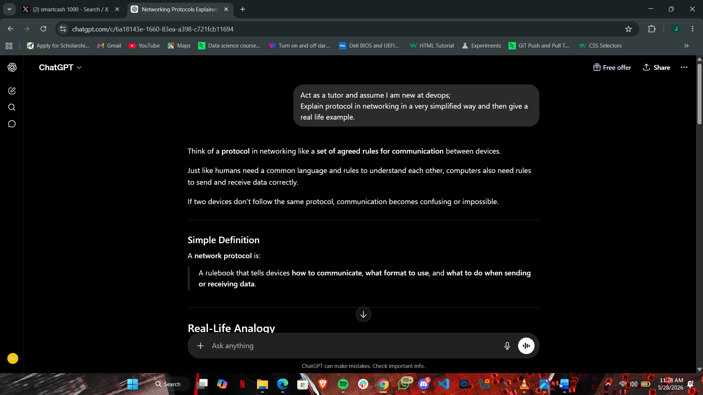
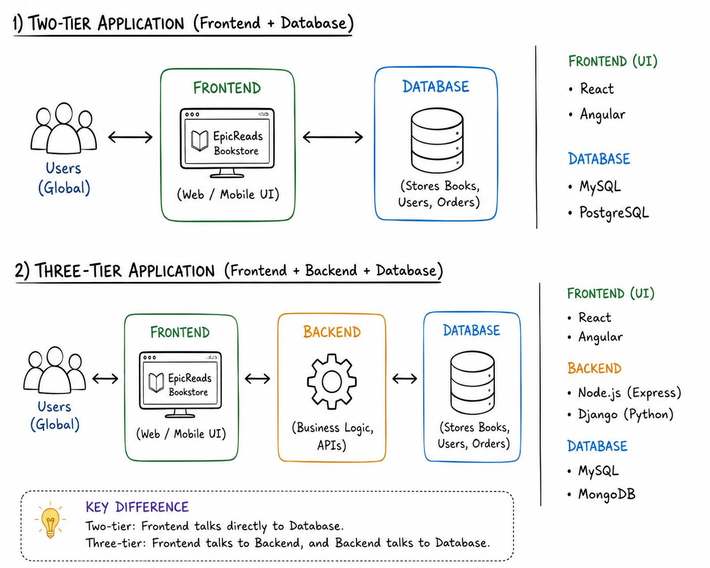
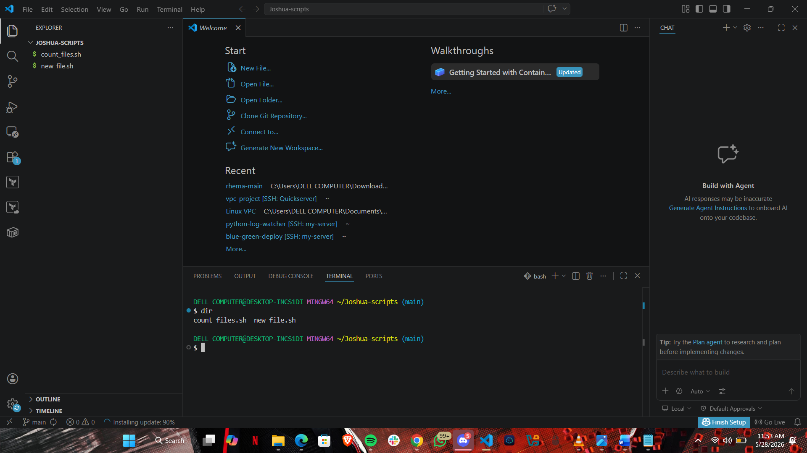

# Week 00 - Internet and Networking

Part of the DevOps Micro Internship (DMI) Cohort 3 with Agentic AI

---

# 🧑‍💻 Task 1: Using ChatGPT as Your Learning Assistant

## Scenario

You're new to DevOps and will frequently encounter technical questions. ChatGPT can be your learning companion.

## Your Task

Write a clear ChatGPT prompt to help you understand:

> "What is a protocol in networking? Explain with a simple real-life example."

Take a screenshot of your interaction showing:

* Your detailed prompt (with clear expectations)
* ChatGPT's simplified response with an example

## Screenshot

Save your screenshot in the `screenshots` folder and update the file name below.




Replace `task-1-chatgpt.png` with your actual screenshot file name.

---

## What I Learned (2–3 lines)

I learnt what protocol is in networking and it is like a set of agreed rules for communication between devices.

---

# 🌐 Task 2: Internet and Networking

## Scenario

Your friend is launching an online bookstore named **EpicReads**.

He asked you to explain how users globally can access his website hosted in Finland.

## Your Task

Write a short explanation (**100–150 words**) that includes:

* Packet Switching
* IP Address
* TCP/IP
* HTTP/HTTPS

💡 **Tip:** You may use ChatGPT (as demonstrated in Task 1) to refine your explanation.

## Answer

A protocol in networking is a set of rules that allows devices to communicate correctly over the internet. For my friend’s online bookstore, EpicReads, protocols help users around the world access the website hosted in Finland.
When a user visits EpicReads, their browser uses HTTP/HTTPS to request the website securely. IP handles addressing so the request knows where the Finnish server is located, while TCP ensures all the website data arrives completely and in the correct order.
The internet also uses packet switching, where the website data is divided into small packets before being sent. These packets can travel through different network routes across countries and are reassembled when they reach the user’s device.
This system allows someone in Nigeria, Canada, or Japan to access EpicReads quickly and reliably, even though the website is hosted far away in Finland.

---

# 🏗️ Task 3: Application Architecture & Stack

## Scenario

EpicReads bookstore has two application versions:

### Two-Tier Application

* Frontend
* Database

### Three-Tier Application

* Frontend
* Backend
* Database

## Your Task

* Draw simple diagrams (hand-drawn or tool-based such as draw.io)
* Label each layer clearly
* List at least two common technologies or tools used for each layer
* Submit a screenshot or photo clearly showing your own drawing

## Diagram Screenshot / Photo

Save your diagram image in the `screenshots` folder and update the file name below.




Replace `task-3-diagram.png` with your actual diagram file name.

---

## Technologies Used

### Frontend

* React
* Angular

### Backend

* Node.js
* Django

### Database

* MySQL
* PostgreSQL
---

# 🌍 Task 4: Domain Name & DNS (Basic Concepts)

## Scenario

Your friend's bookstore **EpicReads** is currently accessible through:

```text
52.172.142.222:3000
```

He purchased the domain:

```text
epicreads.com
```

## Your Task

In **50–100 words**, explain in your own words:

1. What is DNS (Domain Name System)?
2. Which DNS record type should be used to connect the domain to the given IP, and why?

## Answer

DNS (Domain Name System) is like the internet’s phonebook. It translates easy-to-remember domain names such as epicreads.com into IP addresses like 52.172.142.222:3000, which computers use to locate servers on the internet. Without DNS, users would need to remember IP addresses to access websites.
To connect the domain to the server IP, an A record should be used. An A record maps a domain name directly to an IPv4 address. In this case, it links epicreads.com to 52.172.142.222:3000, allowing users worldwide to access the EpicReads website using the domain name instead of the IP address.


---

# 💻 Task 5: Visual Studio Code Setup (Hands-on)

## Your Task

Install Visual Studio Code (if not already installed).

Take a screenshot of your VS Code environment showing:

* Terminal open inside VS Code
* Running a basic command:

### Windows

```powershell
dir
```

### Linux / macOS

```bash
pwd
ls
```

* Your selected VS Code theme clearly visible

⚠️ **Important:** The screenshot must show your username or another identifiable detail to confirm it is your environment.

## Screenshot

Save your screenshot in the `screenshots` folder and update the file name below.




Replace `task-5-vscode.png` with your actual screenshot file name.

---

# 🔗 Task 6: Publish Your Assignment as a LinkedIn Post

## Objective

Publishing on LinkedIn helps you:

* Build your professional online presence
* Reinforce your learning
* Document your DevOps journey publicly

## Your Task

Summarize your answers from Tasks 1–5 into a LinkedIn post.

Clearly structure your post into the following sections:

* ChatGPT
* Internet & Networking
* App Architecture
* DNS
* VS Code Setup

Add the following credit note at the end of your post:

> **P.S. This post is part of the DevOps Micro Internship (DMI) with Agentic AI — Cohort 3 — by Pravin Mishra. My graded progress is public: https://dmi.pravinmishra.com/s/YOUR-GITHUB-USERNAME.html · Start your DevOps journey: https://dmi.pravinmishra.com/?utm_source=student&utm_medium=ps-linkedin&utm_campaign=cohort3**

---

## LinkedIn Post URL

Paste your LinkedIn post URL here:

```text
https://www.linkedin.com/posts/joshua-chibuisi-5b9222200_pravin-mishra-the-cloudadvisory-linkedin-activity-7465968870298820609-It2Z?utm_source=share&utm_medium=member_desktop&rcm=ACoAADNKSt0BkwUJXkGvXGi9tUas8IjHyH5UK9c
```

---

## LinkedIn Post Backup Copy

Paste the full text of your LinkedIn post here:

I recently completed a hands-on assessment focused on networking fundamentals, application architecture, and development environment setup as part of my DevOps learning path.
The assessment covered core internet communication concepts including HTTP/HTTPS, TCP, IP addressing, packet switching, and DNS resolution, with emphasis on how these components interact to enable reliable global access to distributed applications.
I also explored two-tier and three-tier application architectures, analyzing the separation of concerns between frontend, backend, and database layers, alongside common technologies used across each tier in modern deployments.
On the infrastructure side, I configured a local development environment with Visual Studio Code and worked through basic terminal operations and tooling setup to support future backend and DevOps workflows.
A solid exercise in reinforcing the foundations behind scalable web applications, network communication, and system design.

P.S. This post is part of the DevOps Micro Internship (DMI) Cohort 3 run by . You can be part of this learning community too. 
JOIN HERE (https://lnkd.in/eg8ezR5Z ) DMI Cohort 3: https://lnkd.in/e-hECT35
Pravin Mishra Profile: https://lnkd.in/ew-ctHaH

---

# Reflection – Week 0

### What did you find easy?

I found it easy to work on the assignment and to complete.

---

### What was difficult?

Nothing was really difficult at the time.

---

### What will you improve next week?

To put in my best and continue to finish my assignments on time

---

## 📌 About DMI & CloudAdvisory

DevOps Micro Internship (DMI) is a project-based DevOps program run by Pravin Mishra (The CloudAdvisory) focused on real-world execution, systems thinking, and career readiness.

It helps learners build strong DevOps foundations with hands-on experience.


## 📌 Resources

- 🌐 **DMI Official Website:** https://dmi.pravinmishra.com?utm_source=github&utm_medium=readme  
- 🎓 **University:** https://university.pravinmishra.com?utm_source=github&utm_medium=readme  
- 💬 **Discord Community:** https://discord.pravinmishra.com?utm_source=github&utm_medium=readme  
- 📝 **Blog:** https://dmi.pravinmishra.com/blog?utm_source=github&utm_medium=readme  
- ▶️ **YouTube Playlist (DMI Cohort 3):** https://www.youtube.com/playlist?list=PLFeSNDtI4Cho  
- 🔗 **Pravin Mishra (LinkedIn):** https://www.linkedin.com/in/pravin-mishra-aws-trainer/  
- 🏢 **CloudAdvisory (LinkedIn):** https://www.linkedin.com/company/thecloudadvisory/

---

*This submission is part of DevOps Micro Internship (DMI) Cohort 3 — Agentic AI Track*