# Assignment 3 — Production Maintenance Drill (OPS Checklist)

Part of the DevOps Micro Internship (DMI) Cohort 3 with Agentic AI

---

## Purpose

In this assignment, you will treat your already deployed React application (on Ubuntu VM with Nginx) as a live production system. You will perform structured operational checks covering network validation, service health, log analysis, resource monitoring, configuration verification, and incident simulation with recovery — mirroring real on-call DevOps responsibilities.

---

# Task 1 — Server Access & Networking Validation

## Goal

Verify that the deployed React application is reachable from the browser and confirm basic network connectivity of the Ubuntu VM.

### Evidence

#### Screenshot 1 — Browser showing the React app with your Full Name visible on the UI

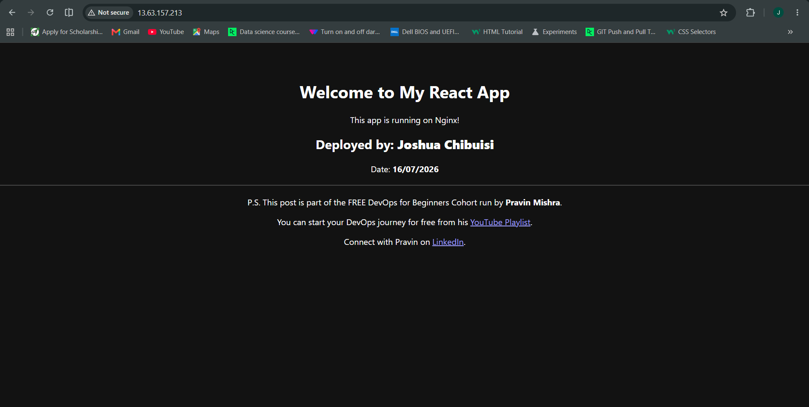

---

#### Screenshot 2 — Output of `ip a`

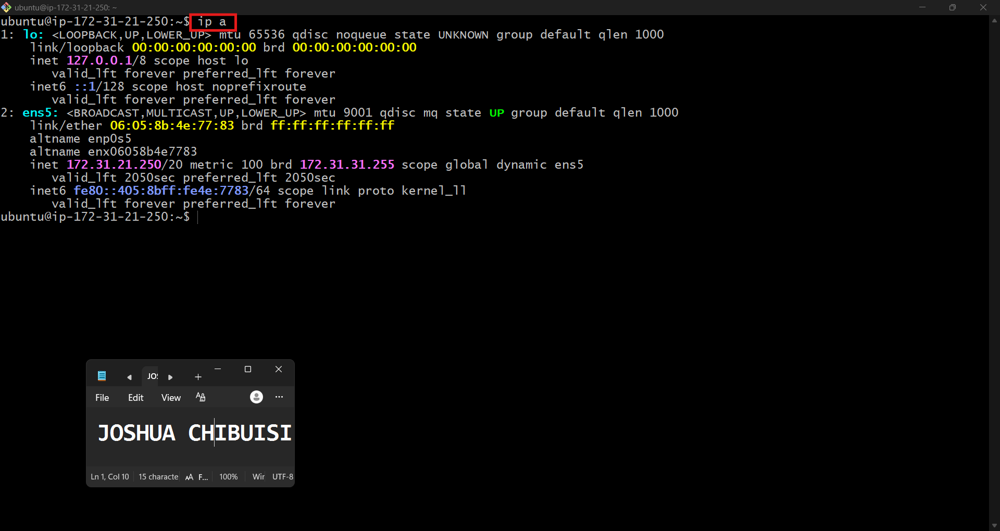

---

#### Screenshot 3 — Output of `sudo ss -tulpen`

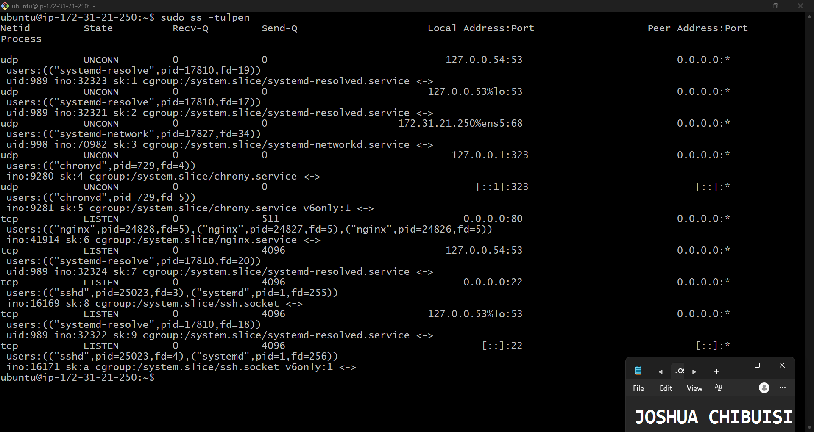

---

#### Screenshot 4 — Output of `sudo ufw status`

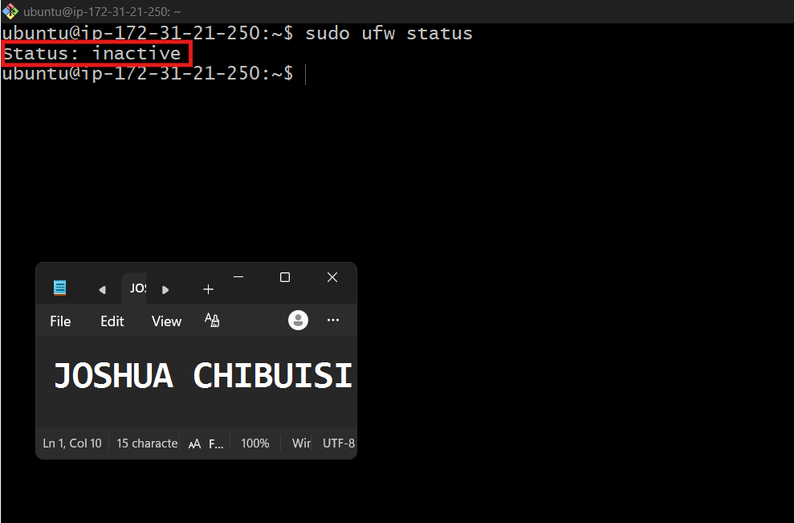

---

### Notes

Answer the following in your own words:

**1. What proves Nginx is listening on 0.0.0.0:80?**

After running the command `sudo ss -tulpen`, you will see an output line matching LISTEN under the state column, 0.0.0.0:80 (or *:80) under the local address column, and nginx explicitly named as the process, and that is what proves it is listening.

---

**2. What proves SSH is active on port 22?**

To prove SSH is active on port 22, the server must be actively listening for connections, and the firewall must allow that traffic.

---

**3. Did you find any unexpected open ports? Explain briefly.**

I didn't find any unexpected open ports, nginx and ssh ports were open.

---

# Task 2 — Service Health & Systemd Validation (Nginx)

## Goal

Verify that Nginx is properly installed, running, enabled at boot, and safely configured.

### Evidence

#### Screenshot 1 — Output of `systemctl status nginx --no-pager`

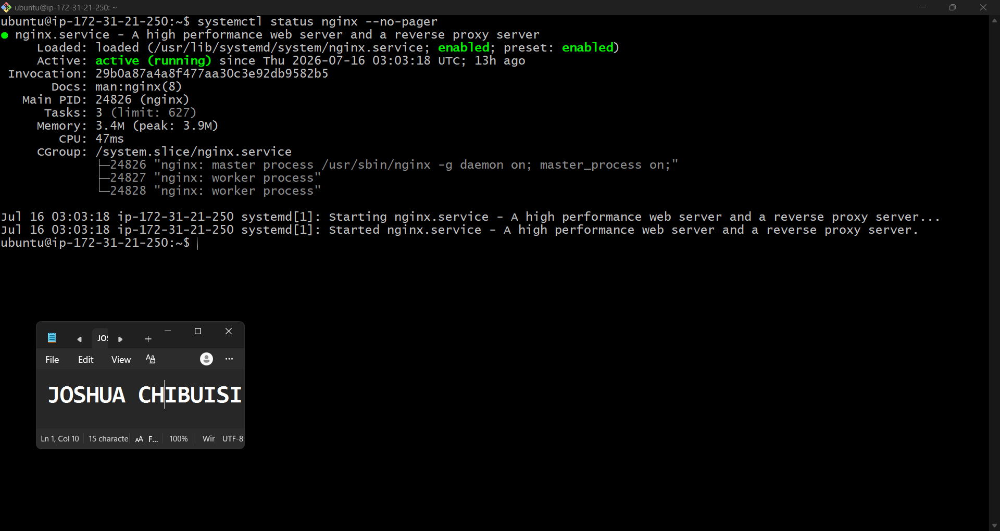

---

#### Screenshot 2 — Output of `sudo nginx -t`

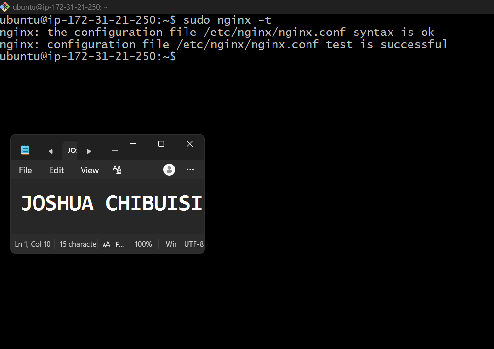

---

#### Screenshot 3 — Output of `sudo ss -lptn '( sport = :80 )'`

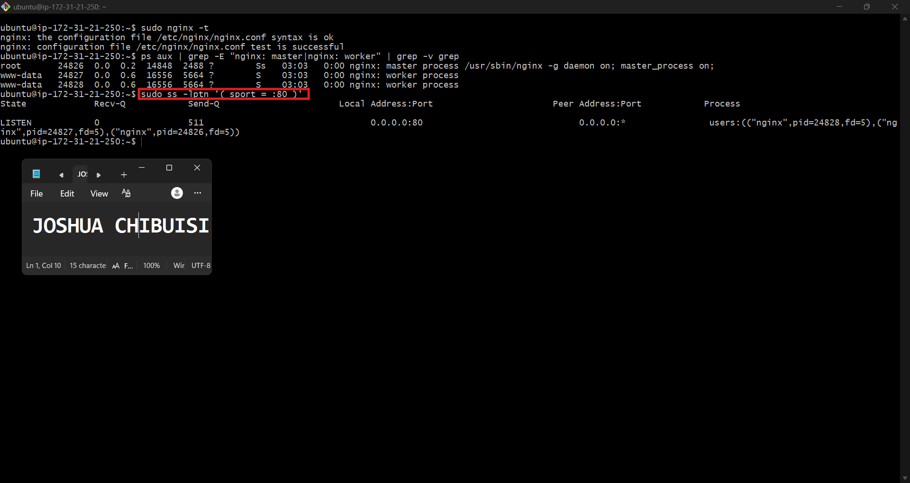

---

### Notes

Answer the following in your own words:

**1. What happens if Nginx fails to restart in production?**

This basically means that the entire website will become unreachable if Nginx fails to restart in production.

---

**2. What's your basic rollback plan?**

The very first thing to do is to run `sudo nginx -t` to make sure that there isn't any error in the config syntax. After doing that, we run a restart, and if the restart fails, the next thing to do is to run `systemctl status nginx --no-pager`to see the exact error. If eventually the error is a bad configuration change, revert the config file back to a previous okay version ideally from a backup and then re-run `sudo nginx -t` followed by `sudo systemctl restart nginx`

---

# Task 3 — Logs & Request Trace

## Goal

Verify real traffic flow and analyze logs to understand system behavior and errors.

### Evidence

#### Screenshot 1 — Output of `sudo tail -n 30 /var/log/nginx/access.log`

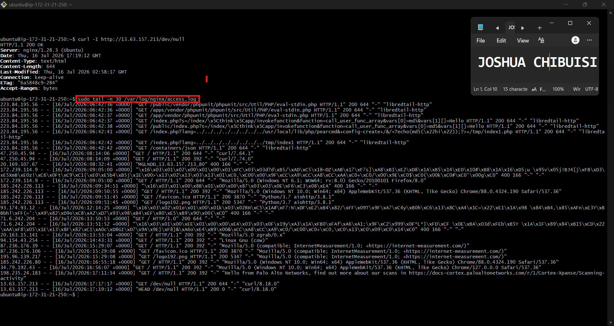

---

#### Screenshot 2 — Output of `sudo tail -n 30 /var/log/nginx/error.log`

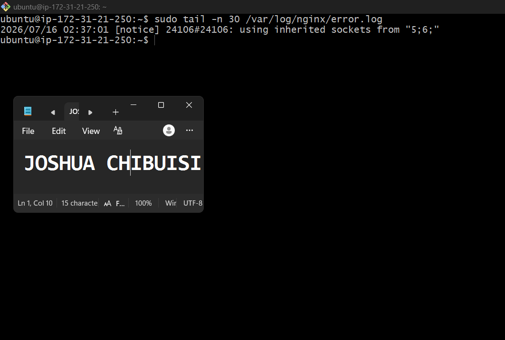

---

#### Screenshot 3 — Output of `sudo journalctl -u nginx --no-pager -n 50`

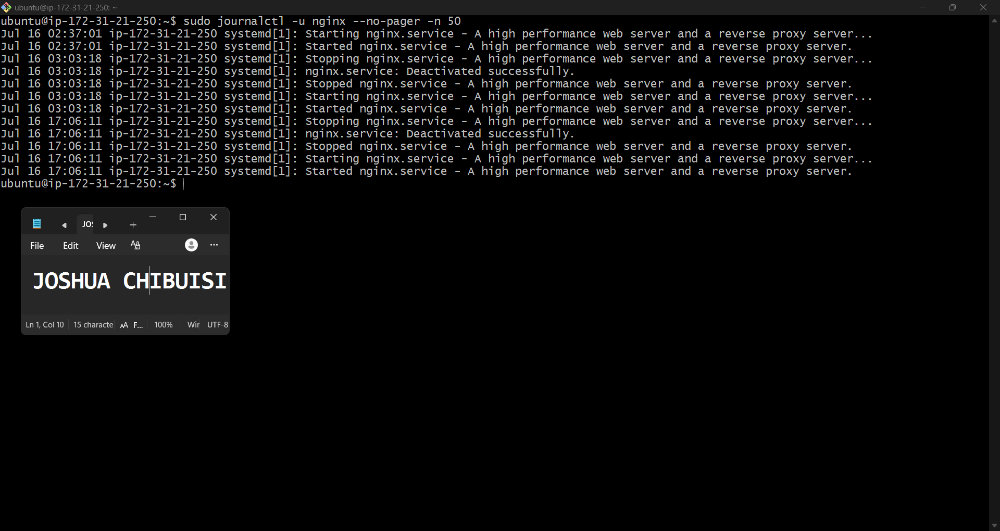

---

### Notes

Answer the following in your own words:

**1. Were there any errors in the logs?**

- If yes, mention 1–2 example error lines from the logs and explain what each one means in simple terms.
- If no, explain what it means if the error log is empty or shows no recent errors during your check.

No, I didn't see any error lines in the logs, and it means that no predefined faults, crashes, or severe failures were recorded during that timeframe.

---

**2. If there were no errors, what does that indicate about the system?**

It means that the system avoided critical crashes, but it doesn't guarantee everything is working perfectly.

---

**3. Based on the access logs, were your curl requests visible in the log entries? What does that prove about traffic flow?**

Yes, my curl requests were visible in the log entries.

---

# Task 4 — System Resource Health Check (Capacity Red Flags)

## Goal

Assess server capacity and detect potential performance or failure risks.

### Evidence

#### Screenshot 1 — Output of `uptime`

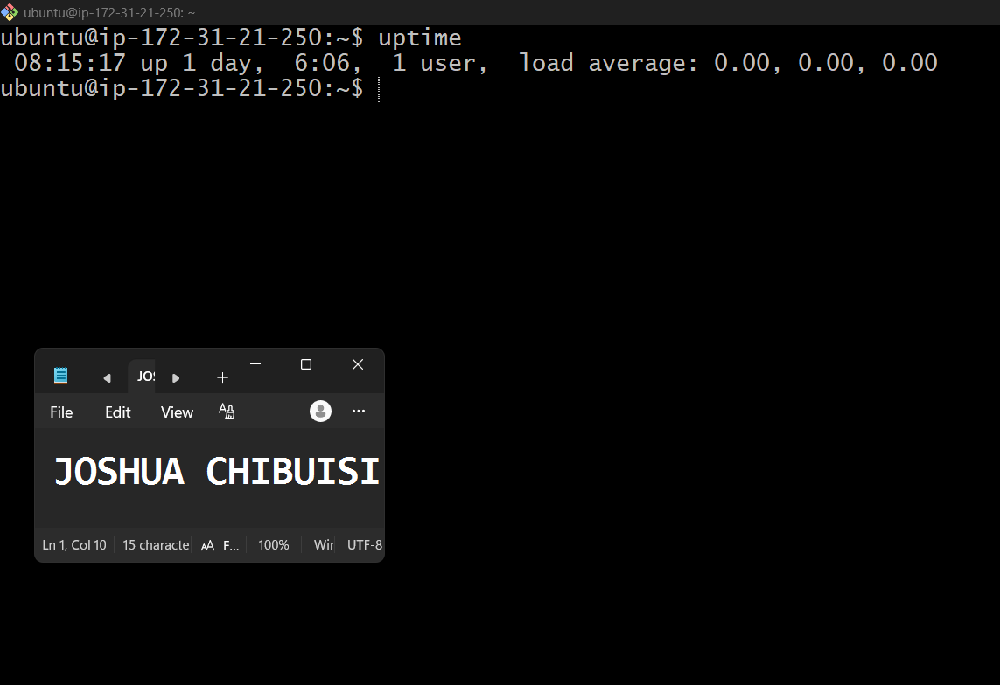

---

#### Screenshot 2 — Output of `free -h`

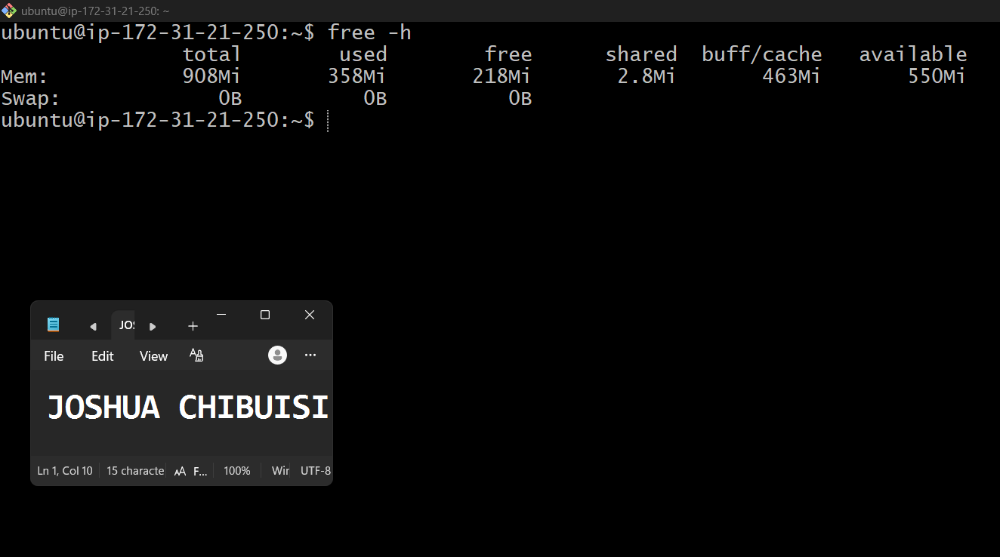

---

#### Screenshot 3 — Output of `df -h`

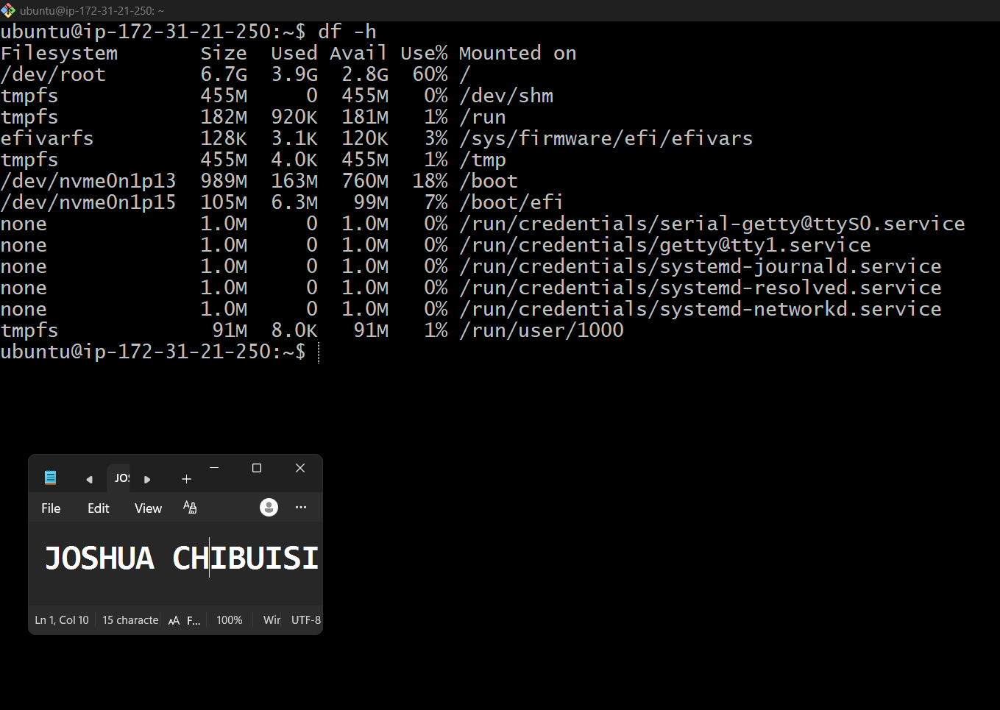

---

#### Screenshot 4 — Output of `sudo du -sh /var/* | sort -h`

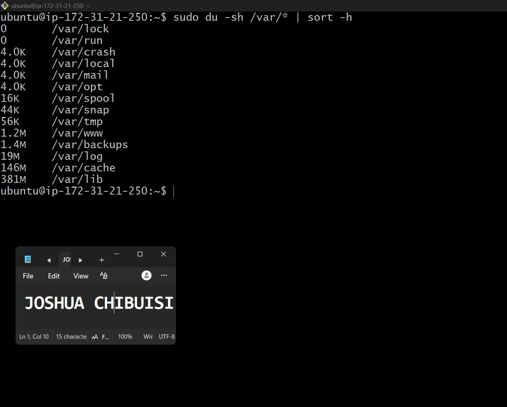

---

### Notes

Answer the following in your own words:

**1. Which resource looks most critical right now? (CPU/load, memory, or disk) Explain why.**

/var/lib looks most critical and that is because it acts as the core workspace for services and background utilities that generate large files over time, rather than storing static system files

---

**2. What happens if disk becomes 100% full in a production server?**

When a disk hits 100% capacity in a production server, all write operations fail with. This immediately triggers widespread service outages. Services depending on disk writes (databases, logs, APIs, containers) will crash, stop responding, or experience erratic behavior like dropping transactions

---

# Task 5 — Configuration & Deployment Verification

## Goal

Ensure the correct React build is deployed and Nginx is serving it properly.

### Evidence

#### Screenshot 1 — Output of `ls -lah /var/www/html | head -n 20`

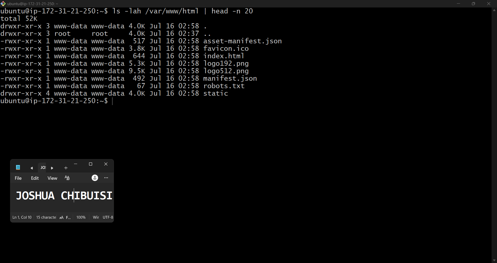

---

#### Screenshot 2 — Output of `grep -R "Deployed by" -n /var/www/html 2>/dev/null | head`

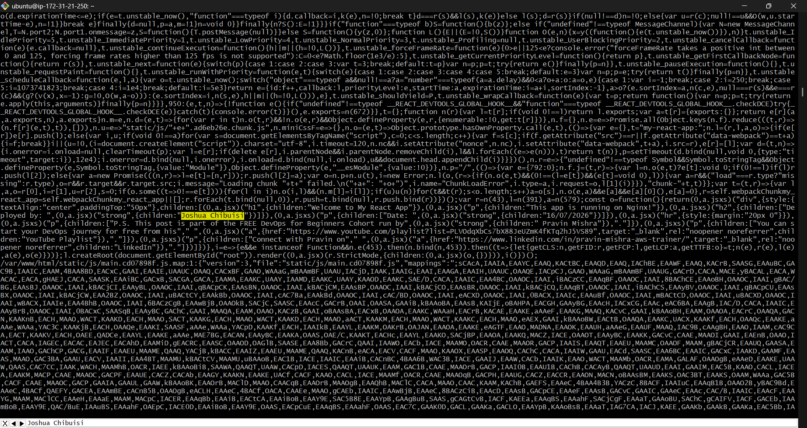

---

#### Screenshot 3 — Output of `grep -n "try_files" /etc/nginx/sites-available/default`

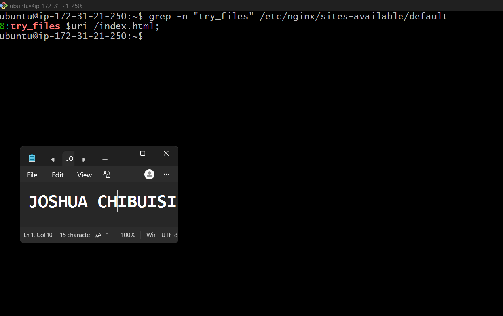

---

### Notes

Answer the following in your own words:

**1. How do you confirm that the correct version of the application is deployed?**

First, I checked the files in /var/www/html using ls -lah, and then confirmed that the React build files are present (like index.html and static folder). I also verified my custom change is deployed by checking the "Deployed by Joshua Chibuisi" line in the code. I then had to ensure Nginx is serving the correct application through the correct web root and then I validated that the application loads correctly in the browser.

---

# Task 6 — Nginx Configuration Failure Simulation

## Goal

Simulate a real-world Nginx misconfiguration and recover the service safely.

### Evidence

#### Screenshot 1 — Output of `sudo nginx -t` showing the syntax error (broken config)

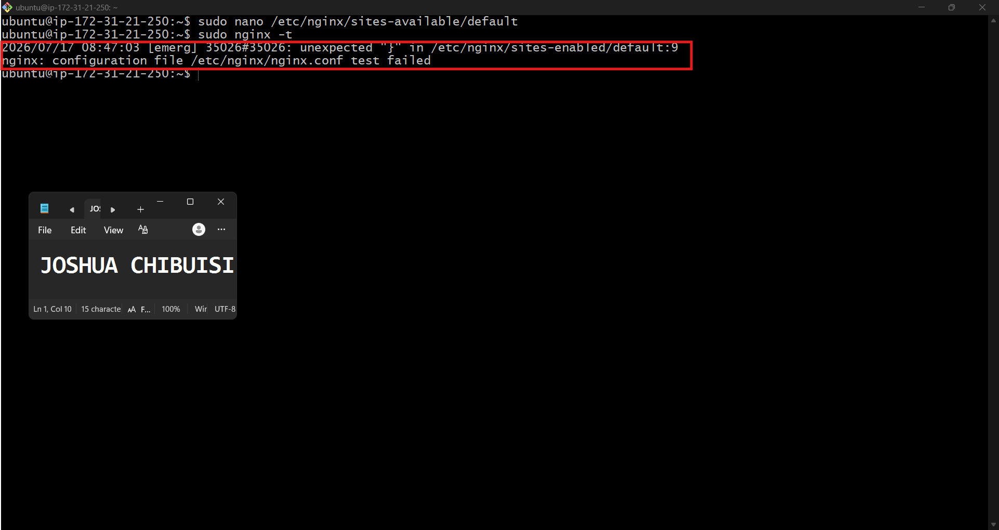

---

#### Screenshot 2 — Output of `sudo nginx -t` showing syntax ok (fixed config)

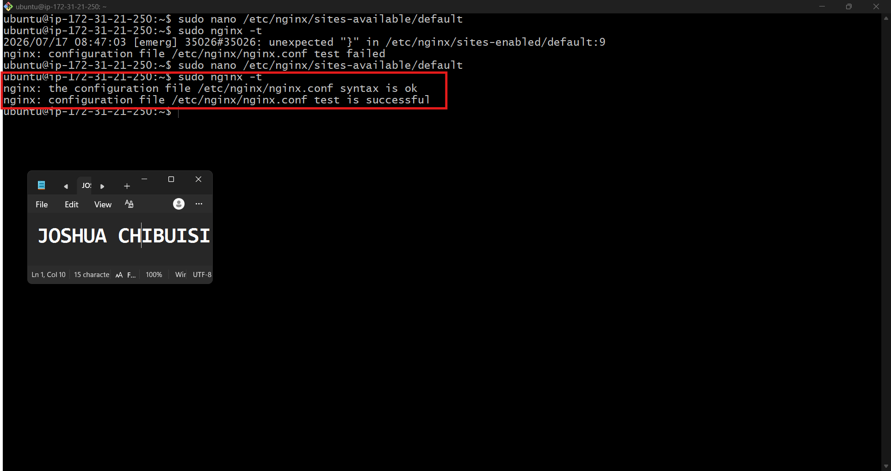

---

#### Screenshot 3 — Output of `curl -I http://<public-ip>` confirming recovery (200 OK)

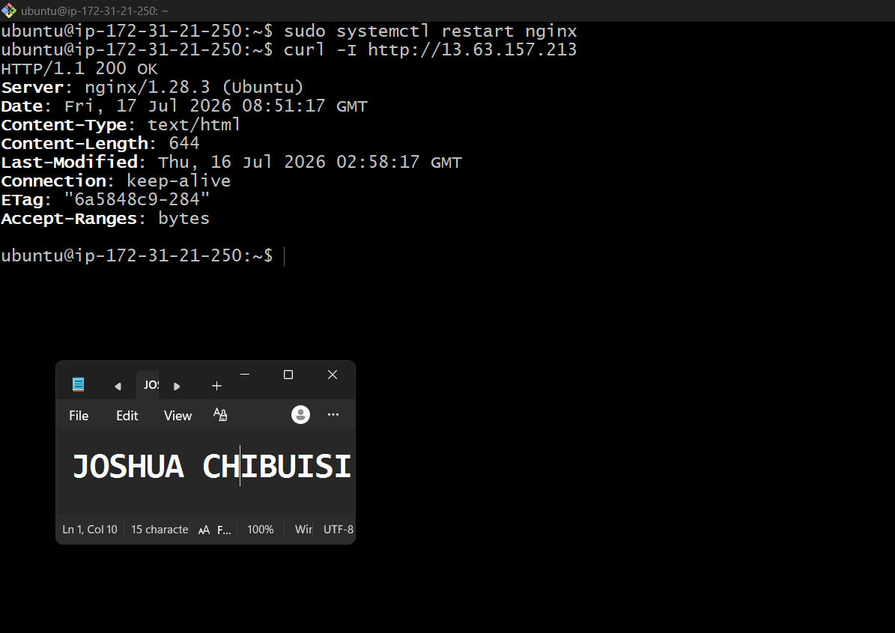

---

### Notes

Answer the following in your own words:

**1. What caused the configuration failure?**

Removing the semi-colon after `try_files $uri /index.html` caused the configuration failure.

---

**2. How did you fix the issue?**

I just added back the semi-colon and that fixed the configuration failure.

---

**3. How can you avoid this kind of issue in real production systems?**

To be careful about things like this, colons, semi colons, and also running `sudo nginx -t` to make sure that the configuration is validated

---

# Task 7 — Web Application Failure Simulation

## Goal

Simulate missing deployment content and recover the application safely.

### Evidence

#### Screenshot 1 — Output of `curl -I http://<public-ip>` showing failure (non-200 response)

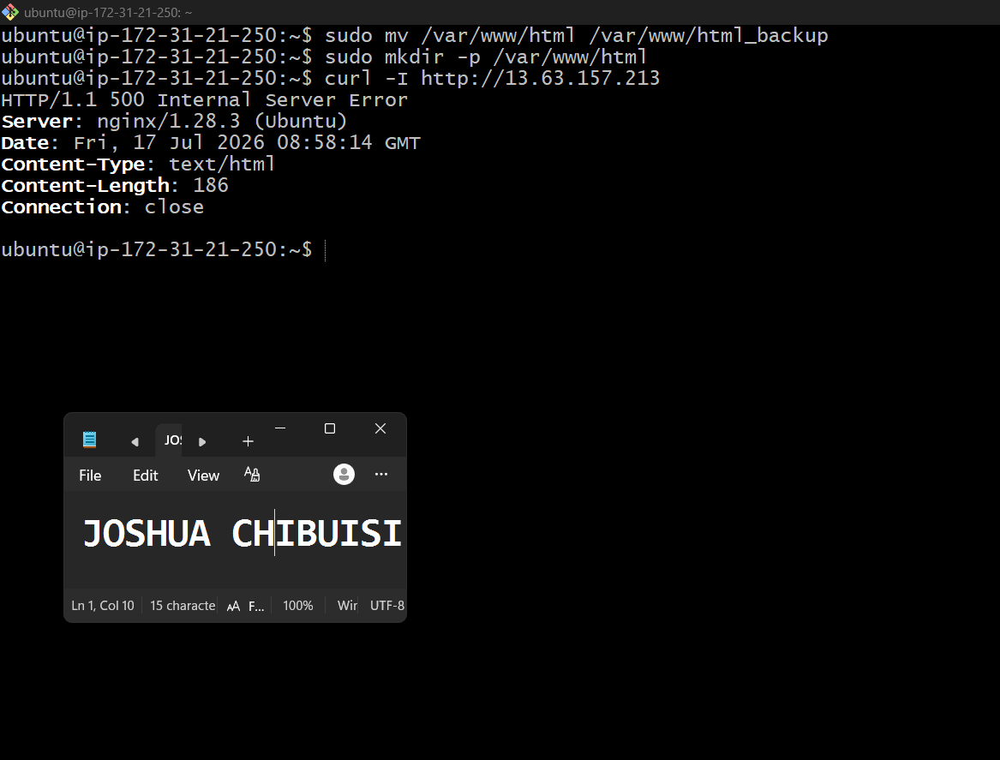

---

#### Screenshot 2 — Output of `curl -I http://<public-ip>` confirming recovery (200 OK)

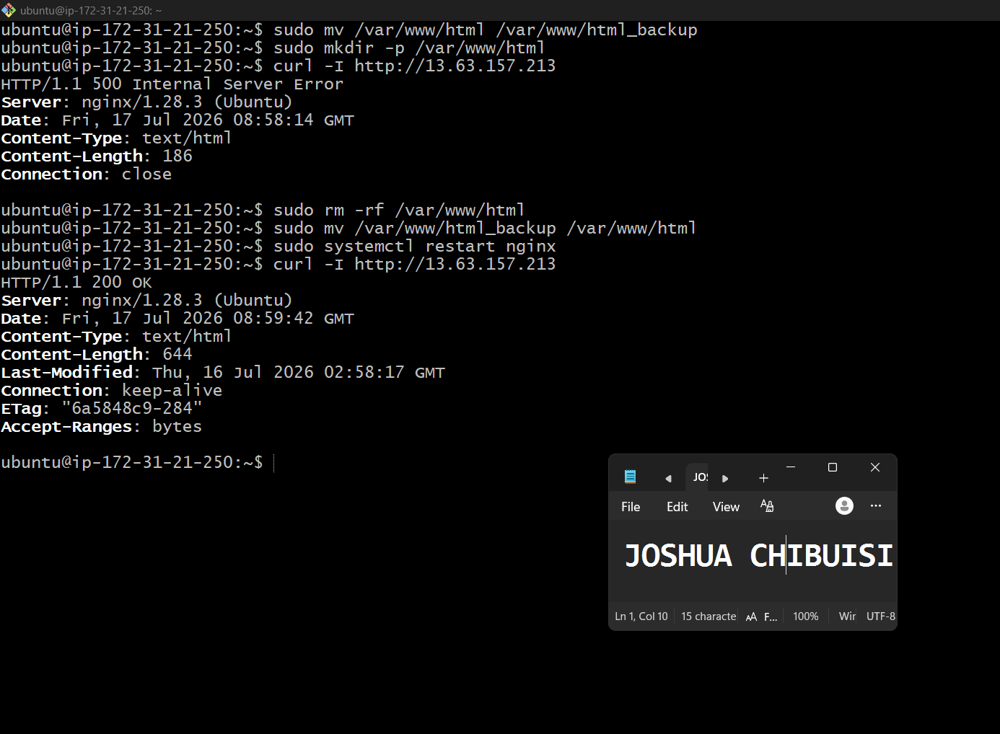

---

### Notes

Answer the following in your own words:

**1. What caused the application to break in this scenario?**

An empty `/var/www/html` folder caused the application to break in this scenario.

---

**2. How did you fix the issue and restore the application?**

The issue was fixed by restoring the backup I had created when it was fine, and then restarting the nginx.

---

**3. What steps would you take to prevent this kind of issue in real production systems?**

To prevent this kind of issue, it is important to have backups, and then to make sure that important folders like `/var/www/html` shouldn't be deleted in the first place.

---

# Task 8 — Security & Reliability Review

## Goal

Review and reflect on the security and reliability practices applied during this assignment.

### Security & Reliability Notes

Answer the following in your own words:

**1. Why is SSH key-based authentication more secure than sharing passwords?**

SSH (Secure Shell) key-based authentication is a method of logging into a remote server using cryptographic key pairs instead of a password. It is more secure because it replaces human-memorable passwords with mathematically complex cryptographic key pairs, ensuring that no sensitive credentials are ever transmitted over the network

---

**2. Why should only required ports be open on a production server?**

Keeping only required ports open on a production server is a foundational security practice that minimizes your attack surface, limits the blast radius of a breach, and prevents unauthorized service exposure.

---

**3. Why is it important for Nginx to be enabled on boot?**

Enabling Nginx on boot ensures your web server and applications immediately resume serving traffic after a system restart or server crash. Without it, your site or APIs will remain offline until manually restarted, causing unnecessary downtime and lost revenue

---

**4. What are the risks of sharing secrets, keys, or credentials publicly?**

The risks are enormous, like allowing attackers to hijack your servers, deploy cryptomining malware, or steal sensitive databases;   give unauthorized users full read and write access to your customers' private information; financial loss via unauthorized cloud computing charges.

---

**5. Why should cloud resources be stopped or terminated when they are no longer needed?**

It should be terminated because it can rack up high costs very quickly.

---

# LinkedIn Post (Required)

## Evidence

#### LinkedIn Post URL

Paste your LinkedIn post URL here:

`https://www.linkedin.com/posts/joshua-chibuisi-5b9222200_dmibypravinmishra-devops-linux-activity-7483937924074557442-LZxG?utm_source=share&utm_medium=member_desktop&rcm=ACoAADNKSt0BkwUJXkGvXGi9tUas8IjHyH5UK9c`

---

#### Screenshot — Published LinkedIn post

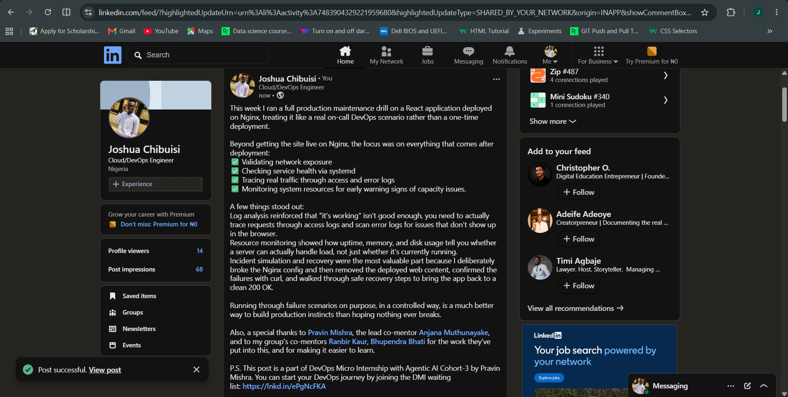

---

# Submission Instructions

- Add all required screenshots in your submission
- Full name must be visible in required screenshots
- Do not expose sensitive information (keys, passwords, account IDs)

---

# Completion Checklist

- [x] Task 1: Screenshots (browser, ip a, ss -tulpen, ufw status) + Notes answered
- [x] Task 2: Screenshots (nginx status, nginx -t, ss port 80) + Notes answered
- [x] Task 3: Screenshots (access log, error log, journalctl) + Notes answered
- [x] Task 4: Screenshots (uptime, free -h, df -h, du -sh) + Notes answered
- [x] Task 5: Screenshots (ls html, grep deployed by, grep try_files) + Notes answered
- [x] Task 6: Screenshots (nginx -t fail, nginx -t pass, curl recovery) + Notes answered
- [x] Task 7: Screenshots (curl failure, curl recovery) + Notes answered
- [x] Task 8: Security & Reliability Notes answered
- [x] LinkedIn post published and URL submitted
- [x] Full Name visible in all required screenshots
- [x] No sensitive data exposed

---

## 📌 About DMI & CloudAdvisory

DevOps Micro Internship (DMI) is a project-based DevOps program run by Pravin Mishra (The CloudAdvisory) focused on real-world execution, systems thinking, and career readiness.

It helps learners build strong DevOps foundations with hands-on experience.

---

## 📌 Resources

- 🌐 DMI Official Website: https://pravinmishra.com/dmi  
- 🎓 DevOps for Beginners (Udemy): https://www.udemy.com/course/devops-for-beginners-docker-k8s-cloud-cicd-4-projects/  
- 🎓 Agentic AI DevOps with Claude Code: https://www.udemy.com/course/ultimate-agentic-ai-devops-with-claude-code/  
- 🎓 DevOps with Claude Code: Terraform, EKS, ArgoCD & Helm: https://www.udemy.com/course/devops-with-claude-code-terraform-eks-argocd-helm/  
- ▶️ YouTube Playlist: https://www.youtube.com/playlist?list=PLFeSNDtI4Cho  
- 🔗 Pravin Mishra (LinkedIn): https://www.linkedin.com/in/pravin-mishra-aws-trainer/  
- 🏢 CloudAdvisory (LinkedIn): https://www.linkedin.com/company/thecloudadvisory/

---

*This submission is part of DevOps Micro Internship (DMI) Cohort 3 — Agentic AI Track.*