# Assignment 5 — Bash Script Automation Drill (OPS Checklist)

Part of the DevOps Micro Internship (DMI) Cohort 3 with Agentic AI

---

## Purpose

In this assignment, you will practice Bash scripting by building a series of small automation scripts covering environment setup, variables, arrays, loops, file conditionals, if-else logic, and functions. These scripts form the foundation of real-world Linux automation used in DevOps, cloud, and production support environments.

---

# Task 1 — Bash Environment & Workspace Setup

## Goal

Verify that Bash is available on your system and create a clean workspace for this assignment.

### Evidence

#### Screenshot 1 — Output of `echo $SHELL` and `bash --version`

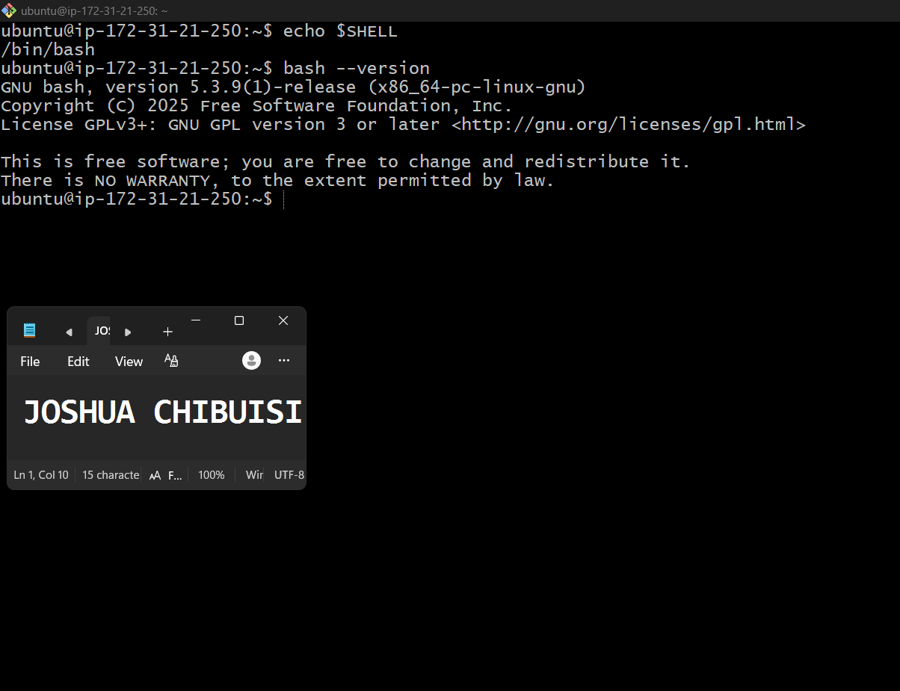

---

#### Screenshot 2 — Output of `pwd` and `ls -lah` showing the scripts directory

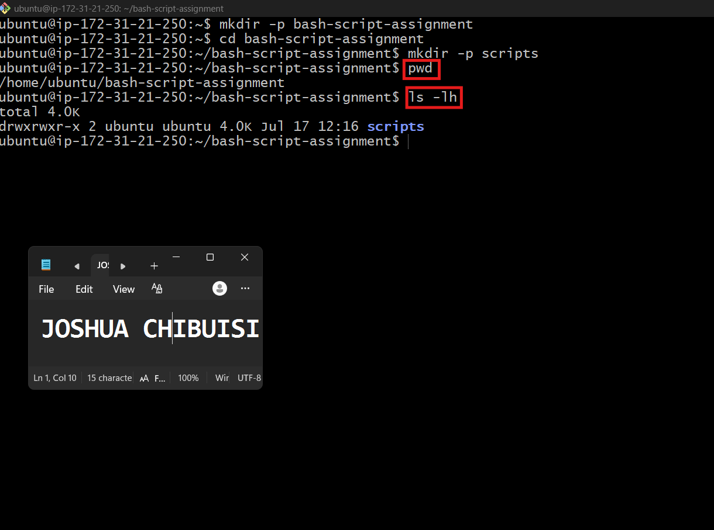

---

### Notes

Answer the following in your own words:

**1. What is Bash?**

It is the default shell for most Linux distributions and macOS, allowing users to run programs, manage files, and automate repetitive tasks by typing commands into a text terminal

---

**2. What is the difference between shell and Bash?**

"shell" is a broad, generic term for any program that provides a text-based interface to interact with your operating system, whereas "Bash" is a specific, highly popular implementation of a shell.

---

**3. Why is it important to confirm the Bash version before writing scripts?**

Confirming your Bash version before writing scripts prevents syntax errors, ensures feature compatibility, and avoids unexpected script failures across different environments.

---

# Task 2 — Your First Bash Script

## Goal

Create your first Bash script, make it executable, and run it from the terminal.

### Evidence

#### Screenshot 1 — Content of `first-script.sh`

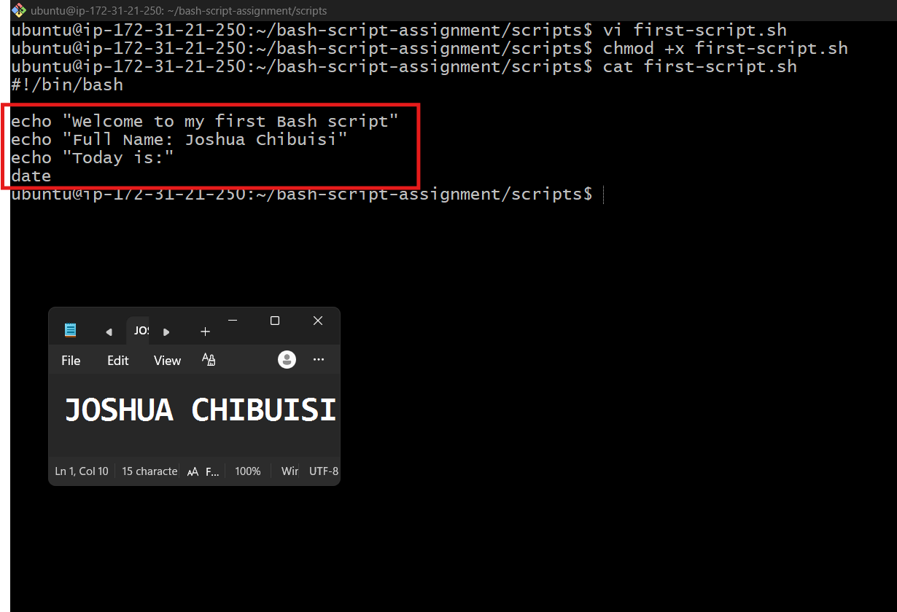

---

#### Screenshot 2 — Output of `./first-script.sh`

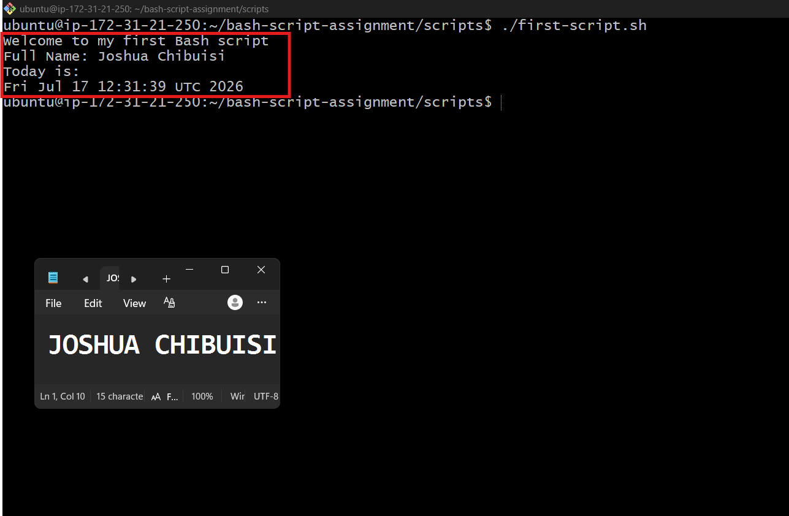

---

#### Screenshot 3 — Output of `ls -l first-script.sh` showing executable permission

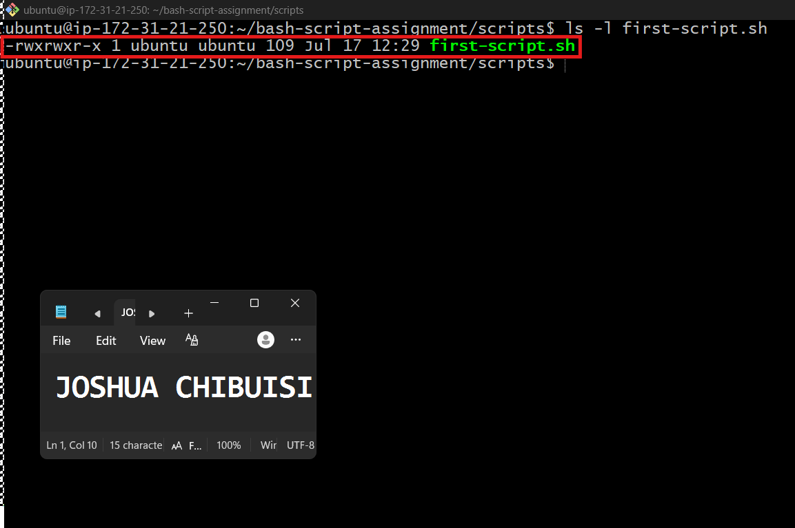

---

### Notes

Answer the following in your own words:

**1. What is the purpose of `#!/bin/bash`?**

The line `#!/bin/bash` is called a shebang, and its purpose is to instruct the operating system to use the Bash shell interpreter to execute the commands contained in the script file

---

**2. Why do we use `chmod +x` before running a script?**

Using `chmod +x` allows the file to be executable as a program or a script

---

**3. What is the difference between running a script using `./script.sh` and `bash script.sh`?**

The primary difference is that ./script.sh executes the script as a standalone program using the interpreter specified inside its shebang line, whereas bash script.sh forces the script to run directly inside the Bash shell, bypassing the shebang completely.

---

# Task 3 — Variables: User Information Script

## Goal

Use variables to store and display user-related information.

### Evidence

#### Screenshot 1 — Content of `user-info.sh`

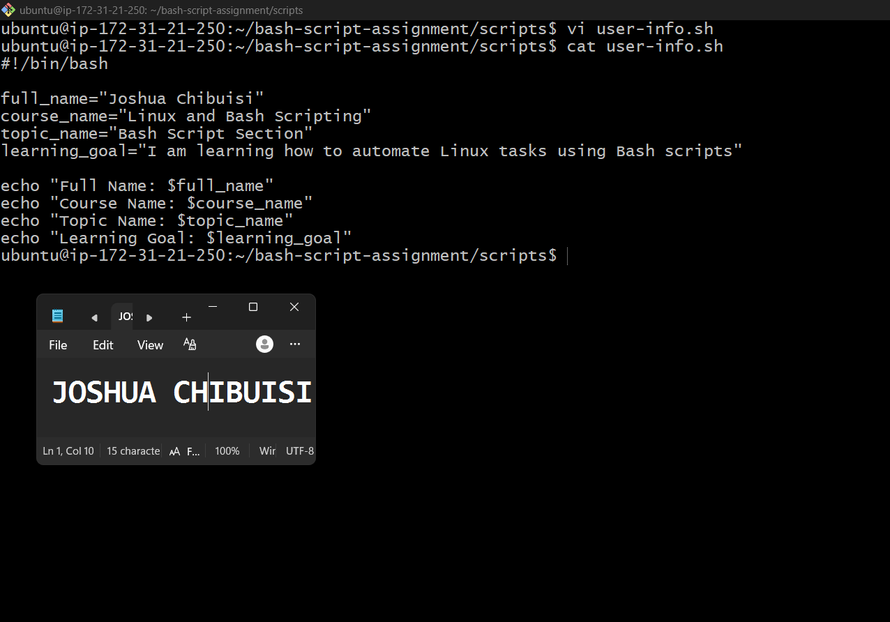

---

#### Screenshot 2 — Output of `./user-info.sh`

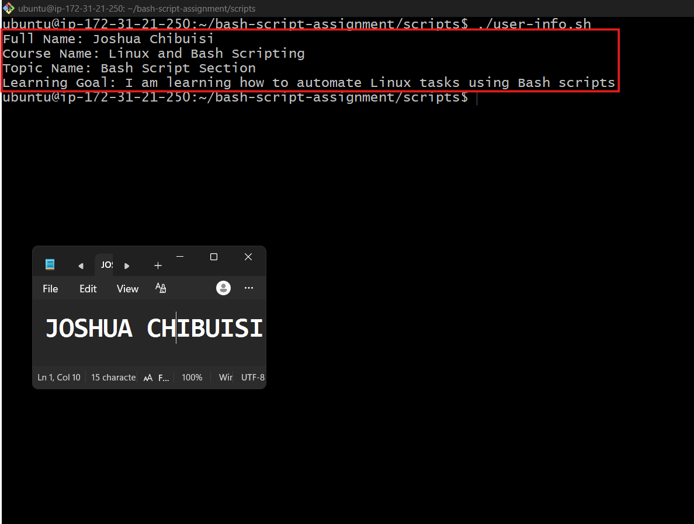

---

### Notes

Answer the following in your own words:

**1. What is a variable in Bash?**

In Bash, a variable is a named storage location in memory used to hold temporary data—such as strings, numbers, filenames, or command outputs—that a script or terminal session can access and modify dynamically.

---

**2. Why should we avoid spaces around the `=` sign when creating variables?**

Avoiding spaces around the = sign in bash scripting is critical because the shell uses whitespace to separate commands and arguments. If you type VAR = "hello", Bash tries to execute a program named VAR and passes = and "hello" as its arguments. By enforcing no spaces, the interpreter clearly knows you intend to assign a value.

---

**3. How do you access the value stored inside a Bash variable?**

To access the value stored inside a Bash variable, you must prefix the variable name with a dollar sign `$`. If you use the variable name without the `$` symbol, Bash will treat it as a literal plain text string rather than retrieving its contents

---

# Task 4 — Arrays & Loops: Tools Checklist Script

## Goal

Use arrays and loops to print a checklist of tools used in Bash scripting.

### Evidence

#### Screenshot 1 — Content of `tools-checklist.sh`

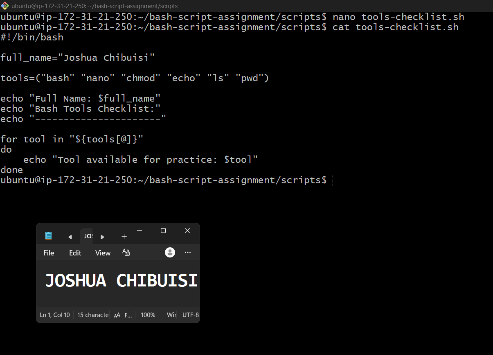

---

#### Screenshot 2 — Output of `./tools-checklist.sh`

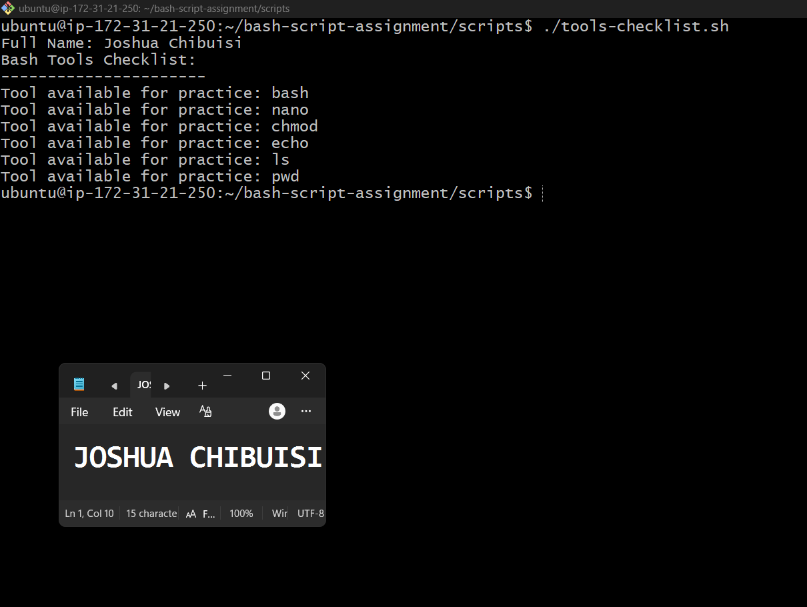

---

### Notes

Answer the following in your own words:

**1. What is an array in Bash?**

An array in Bash is a data structure that allows you to store multiple values inside a single variable name. Instead of creating separate variables for every single item, you can group related items together as elements within a single array structure

---

**2. Why are arrays useful in scripts?**

Arrays are useful in scripts because they allow you to store, manage, and manipulate multiple related values under a single variable name instead of creating separate variables for every item. This significantly reduces code complexity, optimizes memory management, and makes automation scripts scalable.

---

**3. What does `"${tools[@]}"` mean?**

In Bash scripting, "${tools[@]}" expands an array variable named tools into separate arguments, preserving any spaces within individual elements. It is primarily used to pass a complete list of items to a command or loop while treating each item as a distinct, unbroken word

---

**4. What is the purpose of the `for` loop in this script?**

The purpose of the for loop is to iterate through every item in the tools array and perform the same action for each one.

---

# Task 5 — Loops: Number Counter Script

## Goal

Use loops to repeat a task multiple times.

### Evidence

#### Screenshot 1 — Content of `counter.sh`

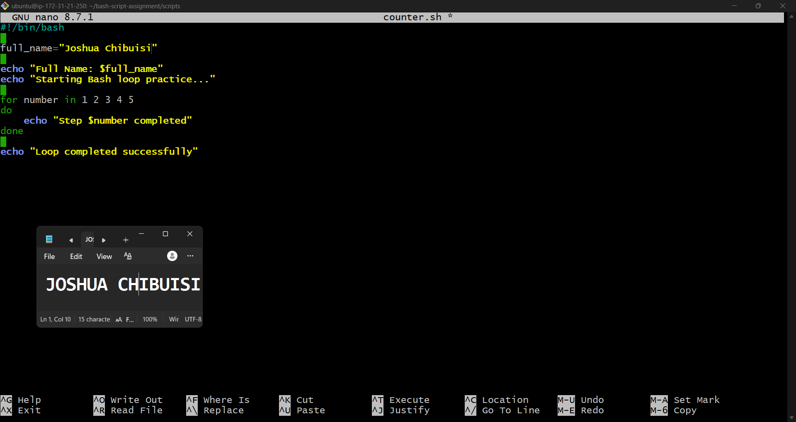

---

#### Screenshot 2 — Output of `./counter.sh`

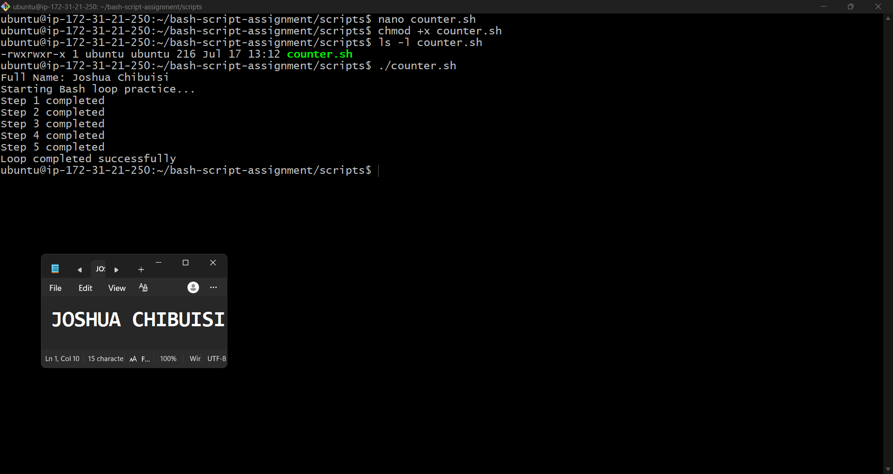

---

### Notes

Answer the following in your own words:

**1. What is a loop?**

A loop is a programming construct that repeatedly executes a block of code until all items have been processed or a specified condition is met.

---

**2. Why do we use loops in Bash scripting?**

Loops are used to:

Automate repetitive tasks instead of writing the same commands multiple times; reduce code duplication, making scripts shorter and easier to read; Improve maintainability, since changes only need to be made in one place; Process multiple items, such as files, directories, or numbers.

---

**3. How many times did the loop run in your script?**

The loop ran five times in my script.

---

**4. What would you change if you wanted the loop to run 10 times?**

for number in {1..10}
do
    echo "Step $number completed"
done

This way makes it easy to scale up, even if I want to make it run 100 times or a thousand times.

---

# Task 6 — Files & Conditionals: File Validation Script

## Goal

Use file checks and conditionals to verify whether files and directories exist.

### Evidence

#### Screenshot 1 — Output of `ls -lah ../test-folder`

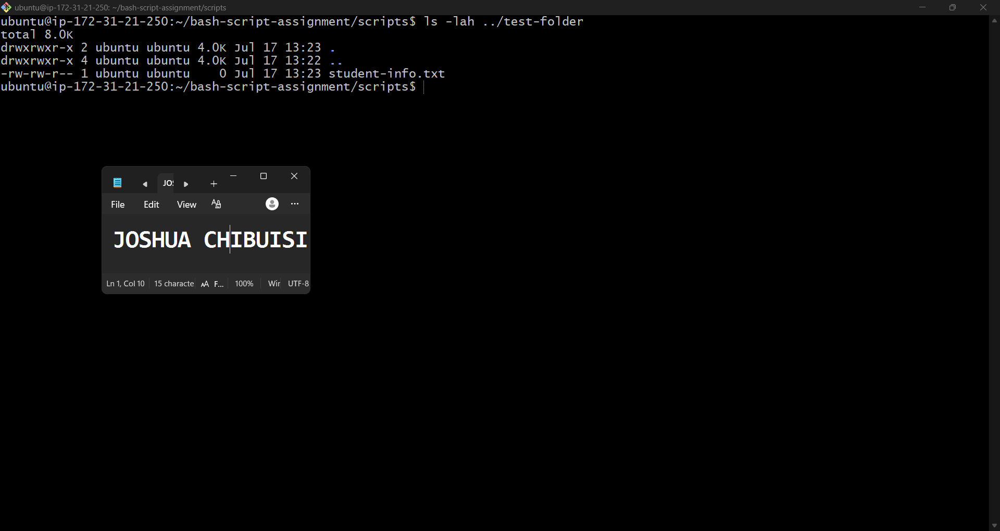

---

#### Screenshot 2 — Content of `file-check.sh`

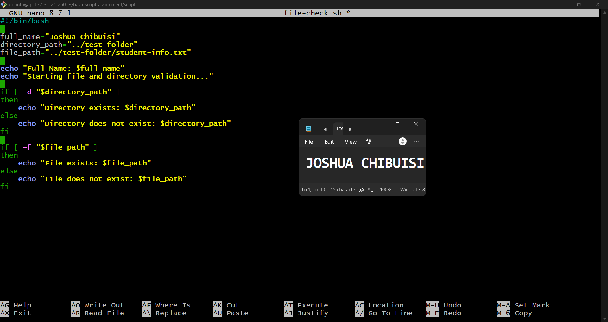

---

#### Screenshot 3 — Output of `./file-check.sh`

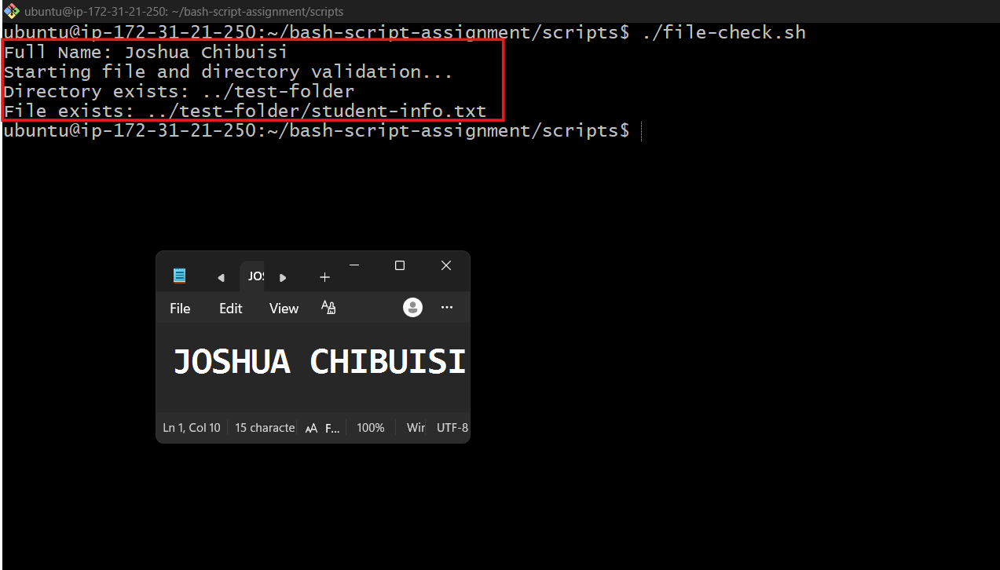

---

### Notes

Answer the following in your own words:

**1. What does `-d` check in Bash?**

The -d test checks whether a directory exists.

---

**2. What does `-f` check in Bash?**

The -f test checks whether a regular file exists.

---

**3. Why should file and directory paths be stored in variables?**

Storing paths in variables in your script makes your script:

Easier to read because the path has a meaningful name.
Easier to maintain since you only need to update the path in one place.
Reusable because the same variable can be referenced multiple times.
Less error-prone because it reduces the need to repeatedly type long paths.

---

**4. What happens if the file does not exist?**

If the file doesn't exist, it prints `Directory does not exist:` to the terminal.

---

# Task 7 — Conditionals: Pass or Retry Script

## Goal

Use if-else conditionals to make decisions based on a variable value.

### Evidence

#### Screenshot 1 — Content of `score-check.sh` with `score=85`

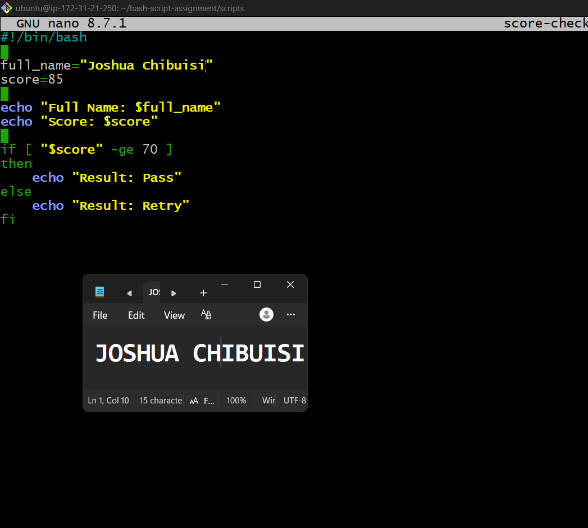

---

#### Screenshot 2 — Output showing `Result: Pass`

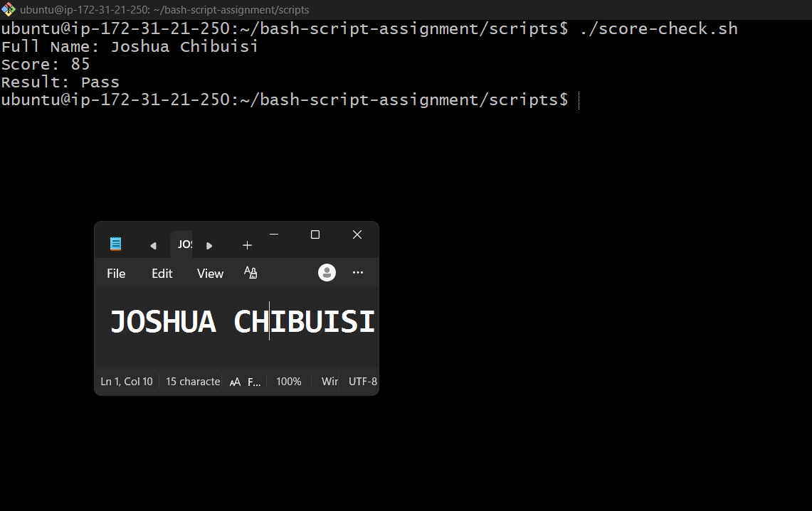

---

#### Screenshot 3 — Content of `score-check.sh` with `score=55`

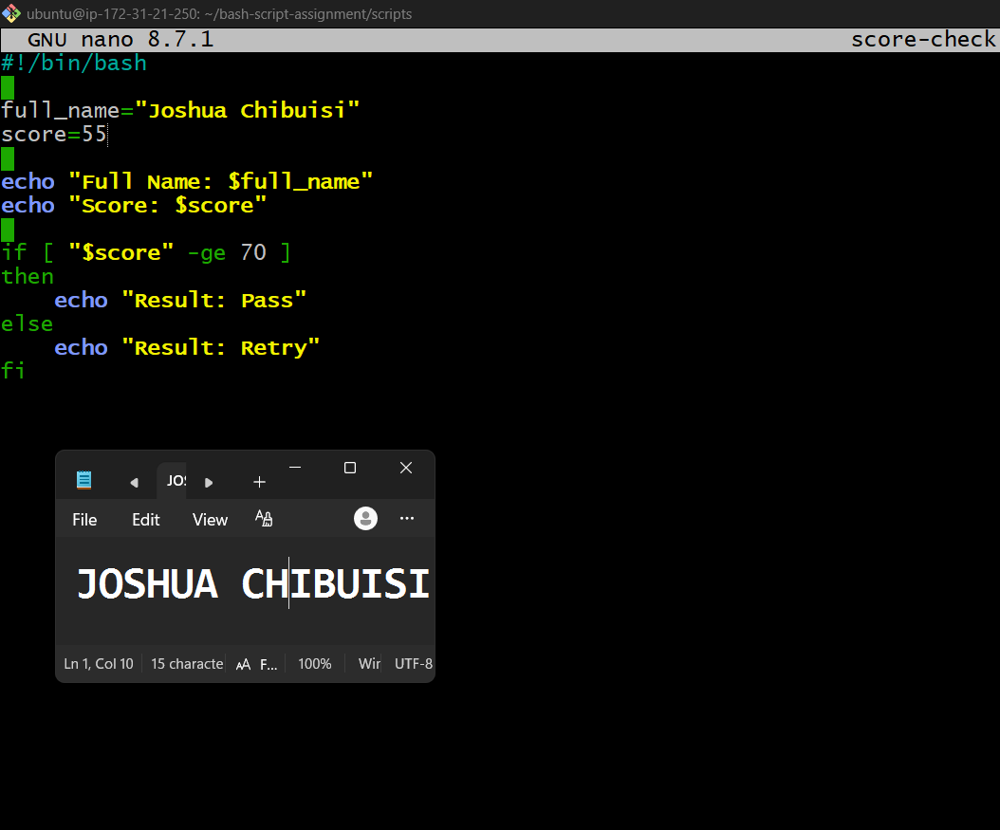

---

#### Screenshot 4 — Output showing `Result: Retry`

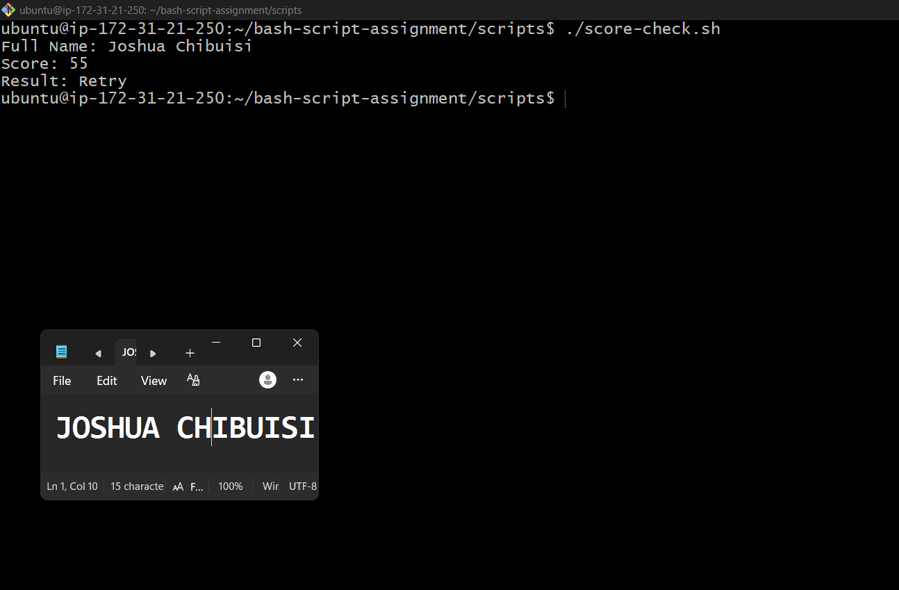

---

### Notes

Answer the following in your own words:

**1. What is the purpose of if-else in Bash?**

The if-else statement allows a Bash script to make decisions based on whether a condition is true or false.

If the condition is true, the commands inside the if block are executed.
If the condition is false, the commands inside the else block are executed.

---

**2. What does `-ge` mean?**

-ge stands for greater than or equal to.

It is one of Bash's numeric comparison operators.

---

**3. Why should conditions be tested with different values?**

Testing different values helps ensure that your script works correctly in all possible situations, not just one.

---

**4. How can conditionals help in automation scripts?**

Conditionals allow automation scripts to make decisions automatically instead of requiring human input.

---

# Task 8 — Functions: Final Bash Automation Script

## Goal

Create a final Bash script using functions to organize reusable code.

### Evidence

#### Screenshot 1 — Content of `final-automation.sh`

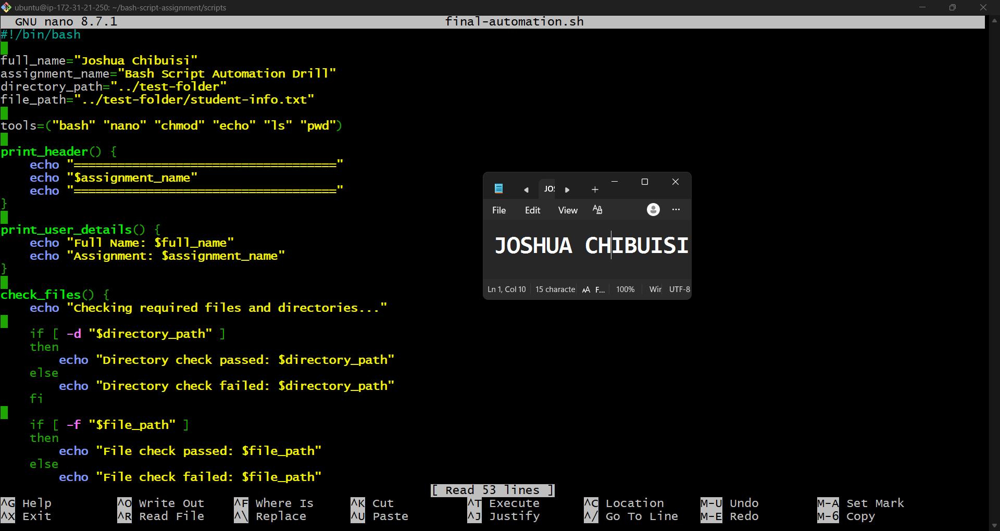

---

#### Screenshot 2 — Output of `./final-automation.sh`

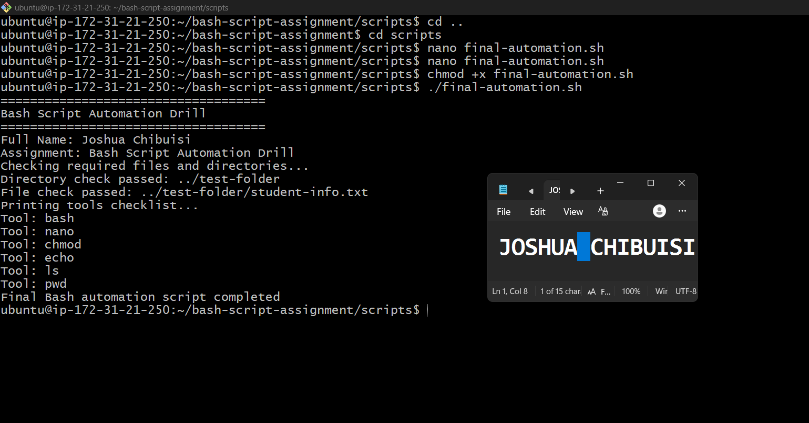

---

#### Screenshot 3 — Output of `ls -lah` showing all created scripts

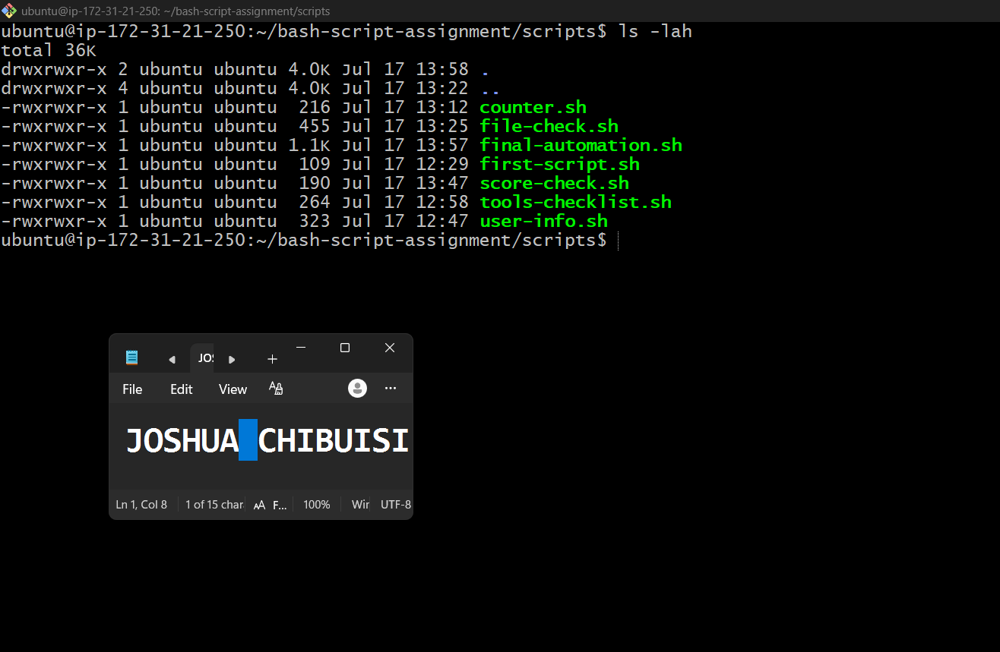

---

### Notes

Answer the following in your own words:

**1. What is a function in Bash?**

A function is a named block of code that performs a specific task. Instead of writing the same code multiple times, you define it once and call it whenever you need it.

---

**2. Why are functions useful in scripts?**

Functions make scripts:

Reusable – Write code once and call it whenever needed.
Organized – Break large scripts into smaller, logical sections.
Easier to maintain – If you need to change a task, you only update the function.
More readable – Function names describe what each section of the script does.

---

**3. Which functions did you create in this script?**

Four functions were created;

`print_header()`
Prints the assignment title and decorative lines. Makes the output easier to read.

`print_user_details()`
Displays your full name and the assignment name.

`check_files()`
Checks whether the required directory exists using -d.
Checks whether the required file exists using -f.
Displays whether each check passed or failed.

`print_tools()`
Loops through the tools array.
Prints each Bash tool in the checklist.

---

**4. How does this final script combine variables, arrays, loops, conditionals, files, and functions?**

Variables; Stores information that can be reused throughout the script.

Arrays; Stores multiple related values in one variable.

Loops; The for loop iterates through the tools array and prints each tool.

Conditionals; if-else statements check whether the directory (-d) and file (-f) exist, then print the appropriate message.

Files and Directories; The script verifies that the specified directory and file exist before reporting success or failure.

Functions; The script organizes related tasks into reusable functions (print_header, print_user_details, check_files, and print_tools) and then calls them in sequence.

---

# LinkedIn Post (Required)

## Evidence

#### LinkedIn Post URL

Paste your LinkedIn post URL here:

`https://www.linkedin.com/posts/joshua-chibuisi-5b9222200_dmibypravinmishra-linux-bash-activity-7483941610007769088-xzOD?utm_source=share&utm_medium=member_desktop&rcm=ACoAADNKSt0BkwUJXkGvXGi9tUas8IjHyH5UK9c`

---

#### Screenshot — Published LinkedIn post

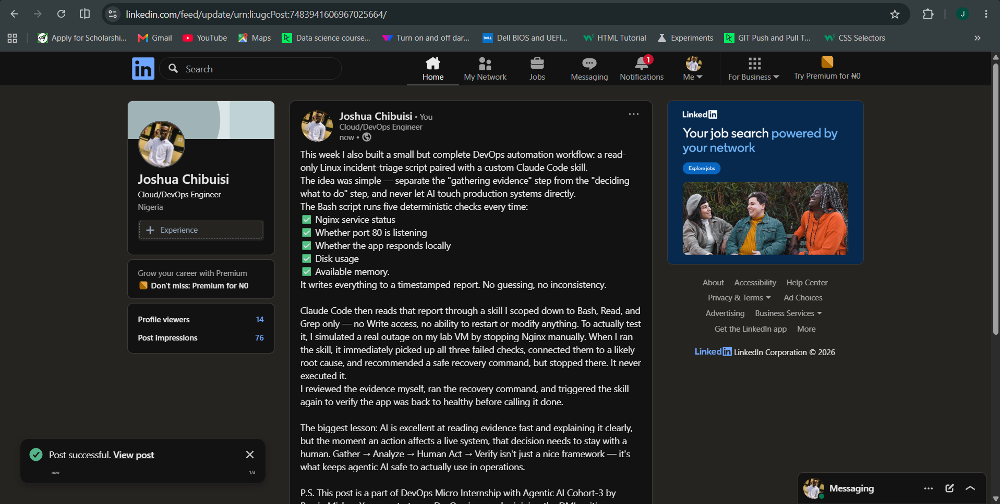

---

# Submission Instructions

- Add all required screenshots in your submission
- Full name must be visible in required screenshots
- All script files must be created and run successfully
- Required notes must be answered clearly for every task
- Do not expose sensitive information (keys, passwords, credentials)

---

# Completion Checklist

- [x] Task 1: Environment setup verified, workspace created (Screenshots 1–2, Notes answered)
- [x] Task 2: First script created, executed, permissions verified (Screenshots 1–3, Notes answered)
- [x] Task 3: Variables script created and run (Screenshots 1–2, Notes answered)
- [x] Task 4: Arrays and loops script created and run (Screenshots 1–2, Notes answered)
- [x] Task 5: Counter loop script created and run (Screenshots 1–2, Notes answered)
- [x] Task 6: File validation script created and run (Screenshots 1–3, Notes answered)
- [x] Task 7: Pass/Retry conditional script tested with both values (Screenshots 1–4, Notes answered)
- [x] Task 8: Final automation script created and run (Screenshots 1–3, Notes answered)
- [x] All scripts run without errors
- [x] Full Name visible in all required screenshots
- [x] LinkedIn post published and URL submitted
- [x] No sensitive data exposed

---

## 📌 About DMI & CloudAdvisory

DevOps Micro Internship (DMI) is a project-based DevOps program run by Pravin Mishra (The CloudAdvisory) focused on real-world execution, systems thinking, and career readiness.

It helps learners build strong DevOps foundations with hands-on experience.

---

## 📌 Resources

- 🌐 DMI Official Website: https://pravinmishra.com/dmi  
- 🎓 DevOps for Beginners (Udemy): https://www.udemy.com/course/devops-for-beginners-docker-k8s-cloud-cicd-4-projects/  
- 🎓 Agentic AI DevOps with Claude Code: https://www.udemy.com/course/ultimate-agentic-ai-devops-with-claude-code/  
- 🎓 DevOps with Claude Code: Terraform, EKS, ArgoCD & Helm: https://www.udemy.com/course/devops-with-claude-code-terraform-eks-argocd-helm/  
- ▶️ YouTube Playlist: https://www.youtube.com/playlist?list=PLFeSNDtI4Cho  
- 🔗 Pravin Mishra (LinkedIn): https://www.linkedin.com/in/pravin-mishra-aws-trainer/  
- 🏢 CloudAdvisory (LinkedIn): https://www.linkedin.com/company/thecloudadvisory/

---

*This submission is part of DevOps Micro Internship (DMI) Cohort 3 — Agentic AI Track.*