# Assignment 6 — Build an AI-Assisted Linux Health Check (AI-Assisted Linux Incident Triage)

Part of the DevOps Micro Internship (DMI) Cohort 3 with Agentic AI

---

## Purpose

In this assignment, you will build a read-only Bash triage script that checks the health of your Ubuntu server and Nginx application, connect it to Claude Code as a reusable `/linux-triage` skill, simulate a controlled Nginx incident, use the skill to gather and analyze evidence, recover the service manually, and verify recovery. The workflow follows the Agentic Loop: Gather → Analyze → Human Act → Verify.

---

# Task 1 — Confirm the Healthy Baseline and Create the Workspace

## Goal

Confirm that Nginx and the React application are healthy before building the automation.

### Evidence

#### Screenshot 1 — Output of `systemctl is-active nginx`, `ss -ltn | grep ':80'`, and `curl -I http://localhost`

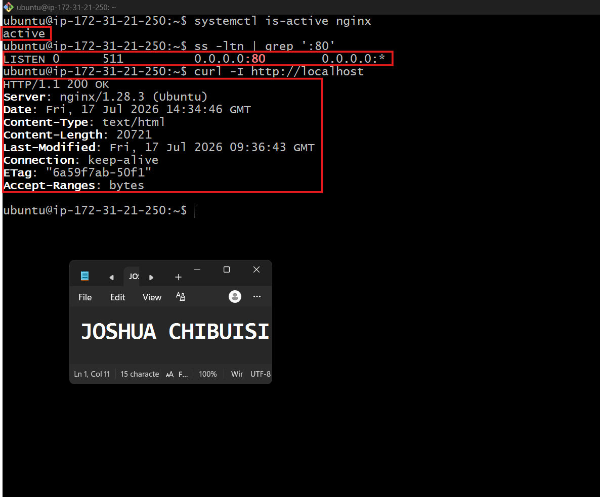

---

#### Screenshot 2 — Output of `pwd` and `find . -maxdepth 4 -type d | sort` showing the workspace folder structure

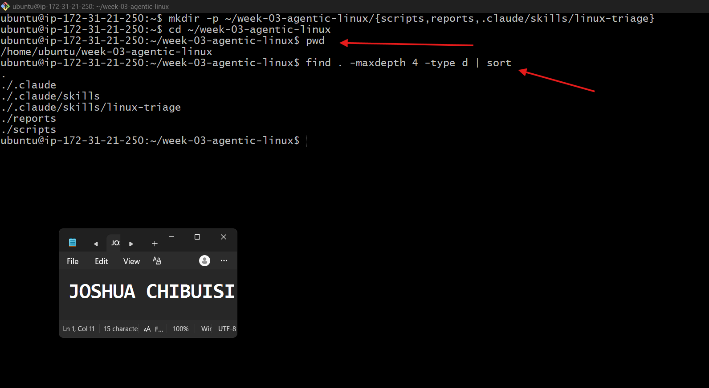

---

### Notes

Answer the following in your own words:

**1. What proves that Nginx is running?**

You can prove that Nginx is running by checking its service status

---

**2. What proves that the server is listening for HTTP traffic?**

HTTP uses port 80 by default. If Nginx is listening for HTTP traffic, port 80 should be in the listening state.

---

**3. Why must you capture a healthy baseline before simulating an incident?**

A healthy baseline records the server's normal state before any changes are made.

This is important because it allows you to:

Compare the server's behavior before and after the incident.
Confirm that any problems were caused by the simulated incident, not by a pre-existing issue.
Verify that your recovery steps returned the system to its original healthy state.
Troubleshoot more effectively by knowing what "normal" looks like.

---

# Task 2 — Create Project Context and Safety Rules in CLAUDE.md

## Goal

Tell Claude exactly what this project does and what it is not allowed to do.

### Evidence

#### Screenshot 3 — CLAUDE.md open in VS Code showing all four sections (Project Overview, Incident Workflow, Safety Rules, Output Rules)

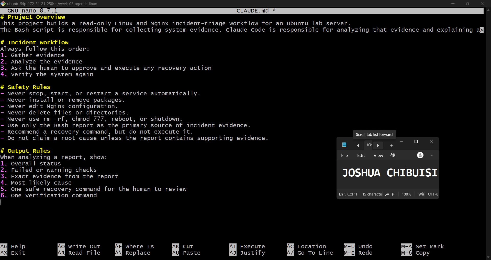

---

### Notes

Answer the following in your own words:

**1. Why should Claude receive project-specific operational rules?**

Project-specific operational rules ensure that Claude behaves according to the requirements, standards, and constraints of a particular project.

---

**2. Why is the human required to execute the recovery command?**

The human is required to execute the recovery command because recovery actions can affect a live system and may have unintended consequences.

---

**3. Which rule prevents Claude from making an unsupported diagnosis?**

The rule that prevents this is the requirement to base conclusions only on observed evidence.

---

# Task 3 — Use Agentic AI to Plan Before Writing the Script

## Goal

Use Claude Code to inspect the environment and produce a read-only plan before creating any Bash code.

### Evidence

#### Screenshot 4 — Claude Code showing the five-check plan and read-only inspection results

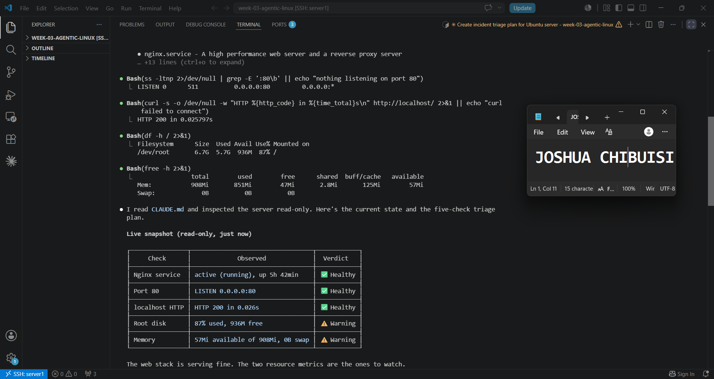

---

### Notes

Answer the following in your own words:

**1. Which part of this task represents the Gather phase?**

Inspecting the Ubuntu server was the gather phase

---

**2. Did Claude follow the instruction not to create files? How did you verify this?**

Yes, it followed my instruction to not create any files, and I verified this by checking the directory, no files were created and it also prompted me to turn it into a single read-only bash report.

---

**3. Why is planning before coding useful in DevOps automation?**

Planning before coding is critical in DevOps automation because it prevents the propagation of flawed logic into live infrastructure. By mapping out workflows, infrastructure requirements, and deployment pipelines in advance, teams reduce rework, ensure security compliance, and prevent automation scripts (like bash) from causing massive system outages

---

# Task 4 — Build the Linux Triage Bash Script

## Goal

Create one Bash script that gathers consistent Linux and Nginx health evidence.

### Evidence

#### Screenshot 5 — Top section of `linux-triage.sh` showing variables, thresholds, and the checks array

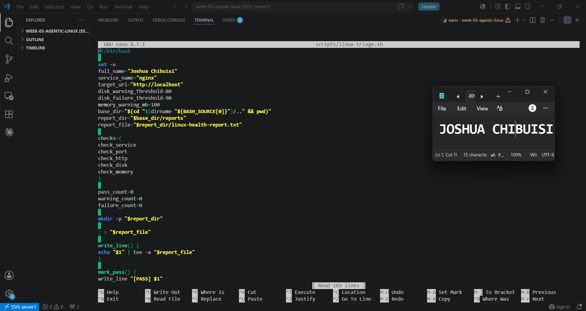

---

#### Screenshot 6 — Middle section showing check functions and conditionals

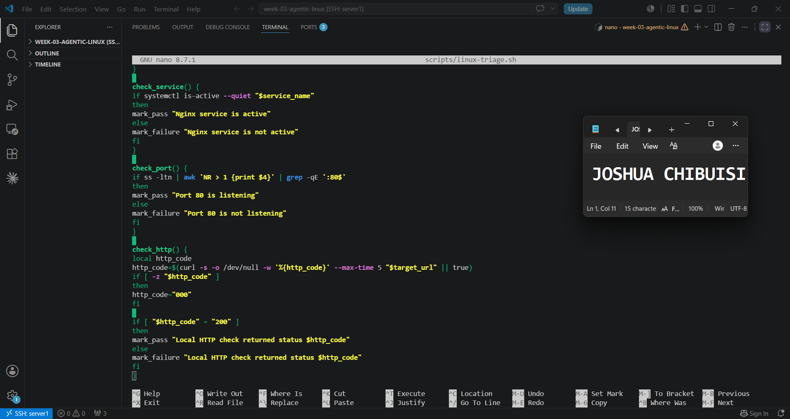

---

#### Screenshot 7 — Bottom section showing the loop, summary function, and exit behavior

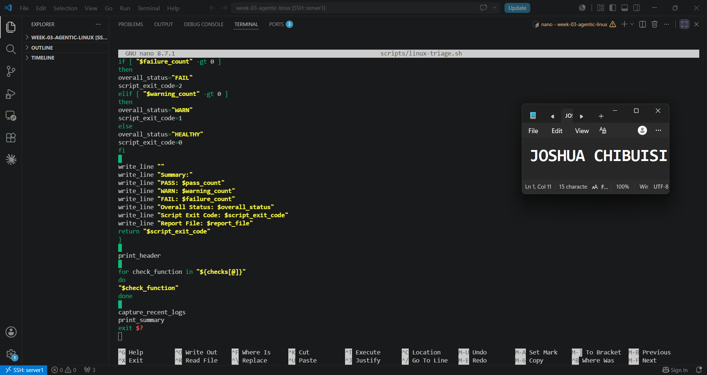

---

#### Screenshot 8 — Output of `bash -n scripts/linux-triage.sh` (no syntax errors) and `ls -l scripts/linux-triage.sh` showing executable permission

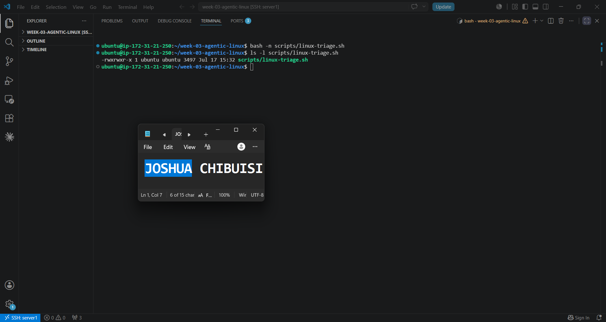

---

### Notes

Answer the following in your own words:

**1. What is stored in the checks array?**

The checks array stores the names of the health check functions that the script should execute.

---

**2. How does the `for` loop use that array?**

The loop iterates through each function name in the checks array and executes it.

---

**3. Why are the health checks separated into functions?**

Separating the checks into functions makes the script:

Modular – Each function performs one specific task.
Readable – The purpose of each section is immediately clear.
Reusable – A function can be called from multiple places if needed.
Easier to maintain – Changes to one health check don't affect the others.
Easy to extend – New checks can be added by creating another function and including it in the checks array.

---

**4. What is the purpose of `$(...)` in this script?**

$(...) is called command substitution.

It executes the command inside the parentheses and substitutes its output.

---

**5. Why does the script use different exit codes for HEALTHY, WARN, and FAIL?**

Exit codes tell the operating system or other programs whether the script succeeded or encountered issues.
HEALTHY	0	All checks passed successfully.
WARN	1	No critical failures, but there are warnings that should be reviewed.
FAIL	2	One or more critical health checks failed and require attention.

---

# Task 5 — Run and Understand the Healthy-State Report

## Goal

Run the Bash script against the healthy server and verify that it creates a report.

### Evidence

#### Screenshot 9 — Output of `./scripts/linux-triage.sh` showing your Full Name and all five check results

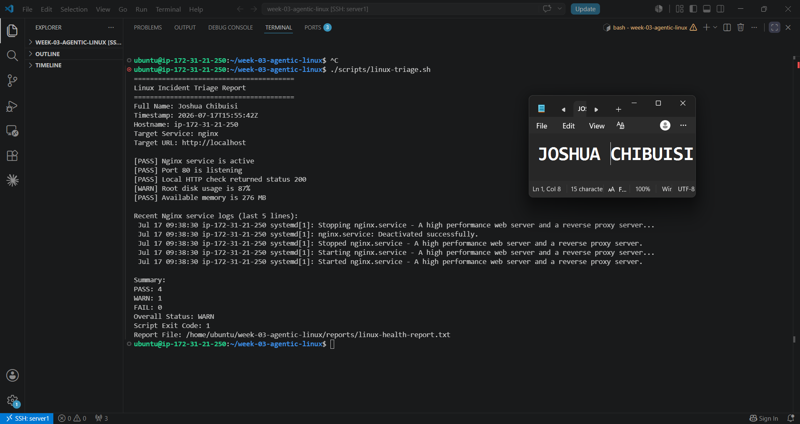

---

#### Screenshot 10 — Output showing the captured exit code and final summary

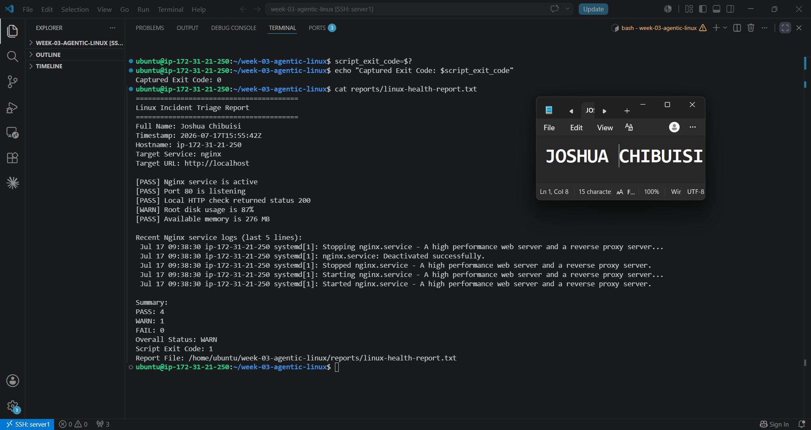

---

### Notes

Answer the following in your own words:

**1. What is the overall status of your healthy baseline?**

The overrall status of my baseline is WARN.

---

**2. Which exact Linux evidence proves the application is serving traffic?**

The exact Linux evidence that proves the application is serving traffic is a successful HTTP response from the application. Running `curl -I http://localhost`

---

**3. Did your script return exit code 0 or 1? Explain why.**

My script returned exit code 1, and it means the script completed successfully, but it detected at least one warning(Root disk usage) that should be reviewed. It is not considered a critical failure.

---

**4. What is the difference between a warning and a failure in this script?**

In this script, the difference between a warning and a failure is the severity of the issue. A warning means the system is still working, there is a condition that could become a problem if ignored, and the script exits with code 1. 
A failure means the issue is critical and immediate action is needed. The script exits with code 2 in this case.

---

# Task 6 — Create and Run the /linux-triage Skill

## Goal

Turn the Bash script into a reusable, manually invoked Agentic AI workflow.

### Evidence

#### Screenshot 11 — `SKILL.md` showing the frontmatter, allowed tool restrictions, and safety rules

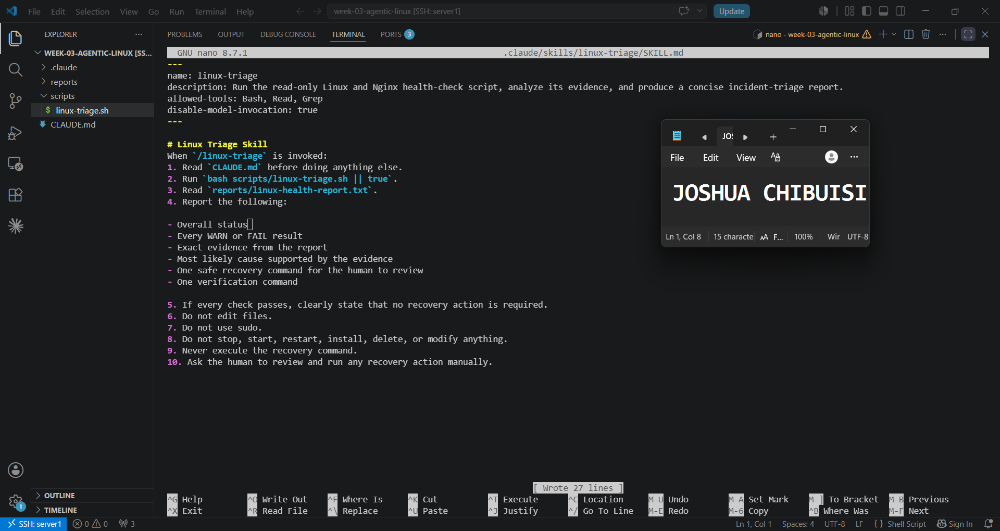

---

#### Screenshot 12 — `/linux-triage` output for the healthy server

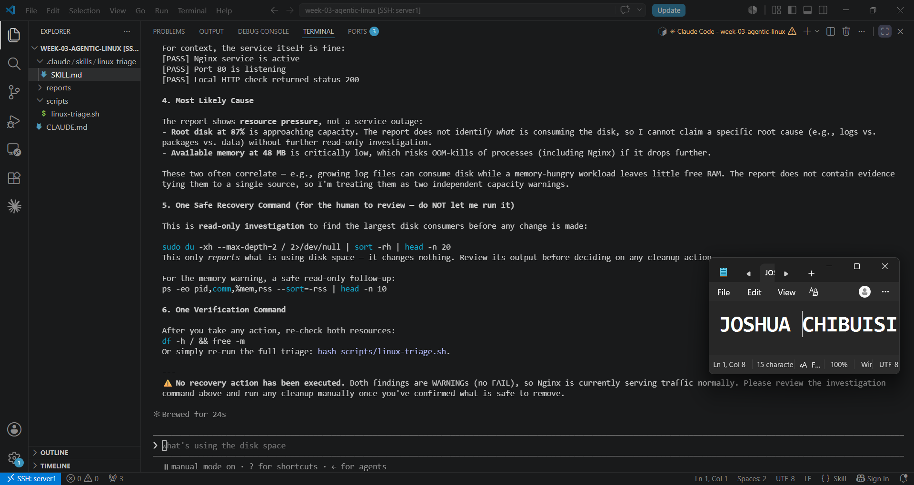

---

### Notes

Answer the following in your own words:

**1. Why does this skill have Bash, Read, and Grep, but not Write?**

It does not have Write because it is not meant to write, or edit any files. Just to read, and search, and to recommend.

---

**2. Why is `disable-model-invocation: true` useful for this skill?**

It is useful for this skill so that it doesn't edit or modify any files.

---

**3. What part is performed by Bash, and what part is performed by Claude?**

The part performed by Bash is the part of running the script, while Claude handles the information gathering and analyzing.

---

**4. Why is this better than asking Claude "Is my server healthy?" without giving it evidence?**

This is better because it gives you evidence and details what is wrong if any of the reports shows failure or warning.

---

# Task 7 — Simulate an Nginx Incident and Let the Skill Diagnose It

## Goal

Create a controlled service failure, gather evidence through Bash, and let Claude analyze the evidence without taking recovery action.

### Evidence

#### Screenshot 13 — Output showing Nginx is inactive and the HTTP request fails

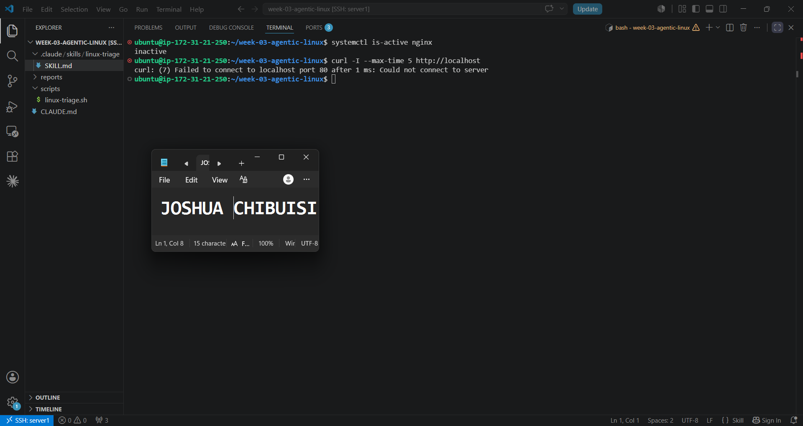

---

#### Screenshot 14 — `/linux-triage` output showing failed evidence, most likely cause, and a suggested recovery command

---

#### Screenshot 15 — `incident-failure-report.txt` showing the failed checks and your Full Name

---

### Notes

Answer the following in your own words:

**1. Which three checks failed?**

The Nginx service, Port 80, and Local http check. Those are the checks that failed.

---

**2. What evidence supports the conclusion that Nginx is unavailable?**

This shows that the service check (systemctl is-active --quiet nginx) failed, meaning the Nginx service is not currently running.

---

**3. Did Claude execute the recovery command? Why is that important?**

No, it didn't execute the recovery command, and this is important because it shows that Claude follows the instructions and everything is in order.

---

**4. Which phase of the Agentic Loop is represented by the Bash report?**

Gathering evidence

---

**5. Which phase is represented by Claude's explanation?**

Verifying results

---

# Task 8 — Recover Manually, Verify Again, and Write the Incident Summary

## Goal

Recover the service as the human operator and prove that the system is healthy again.

### Evidence

#### Screenshot 16 — Output showing Nginx is active and `curl -I http://localhost` returns 200 OK

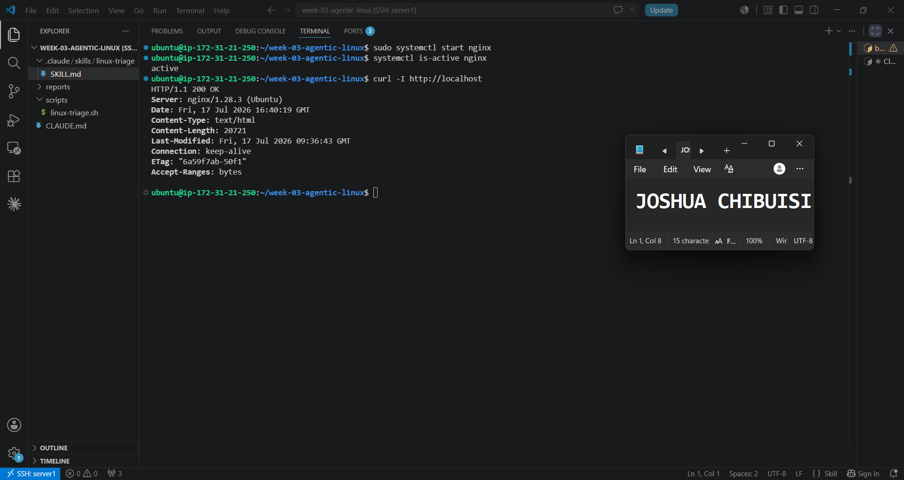

---

#### Screenshot 17 — Second `/linux-triage` output showing successful recovery with no FAIL results

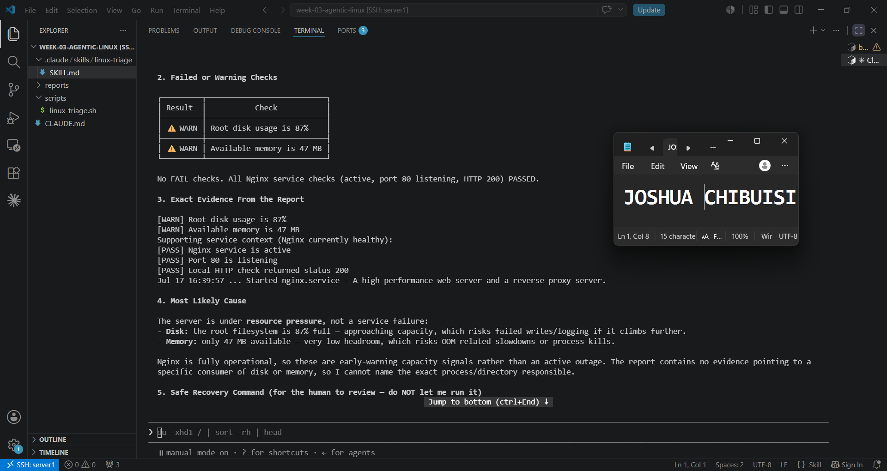

---

#### Screenshot 18 — Output of `ls -lah reports` showing both `incident-failure-report.txt` and `recovery-report.txt`

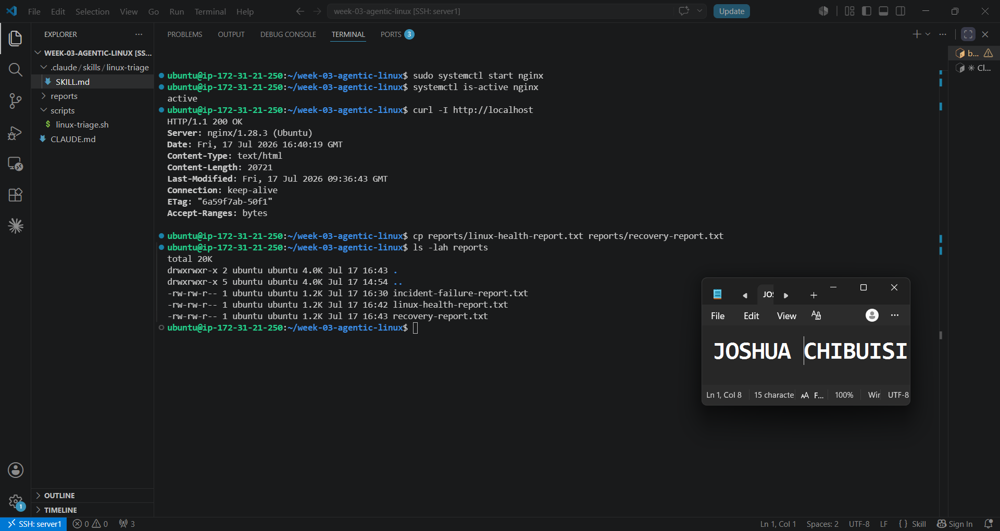

---

#### Screenshot 19 — `incident-summary.md` showing all required sections and your Full Name

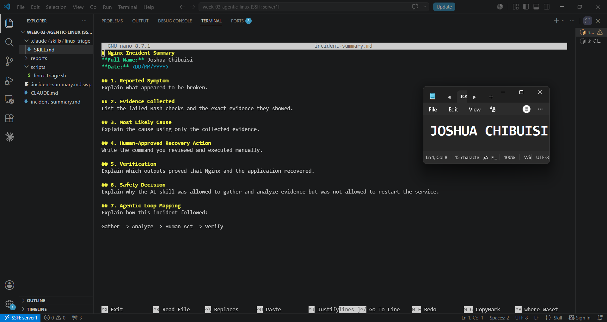

---

### Notes

Answer the following in your own words:

**1. What action did you execute manually?**

I activated the Nginx service again.

---

**2. What evidence proves that the service recovered?**

No FAIL checks. All Nginx service checks (active, port 80 listening, HTTP 200) PASSED.

---

**3. Why is the second triage run necessary?**

It is necessary so that we can confirm that it was successfully recovered and everything is working properly.

---

**4. What could go wrong if an AI agent automatically restarted every failed service?**

A lot could go wrong, it could attempt to delete or modify some files in the process of restarting every failed service.

---

**5. In one sentence, explain the difference between using AI as a chatbot and using AI in this agentic workflow.**

Using AI as a chatbot is just like chatting with friends, but using it in this agentic workflow shows how it can be of help with the proper guardrails in place.

---

# Incident Summary

Fill in all seven sections below in your own words.

**Full Name:** Joshua Chibuisi

**Date:** 17/7/2026

---

**1. Reported Symptom**

Nginx was cleanly stopped, not crashed. 

---

**2. Evidence Collected**

Nginx service wasn't active after running `system is-active nginx`,
`curl -I --max-time 5 http://localhost` returned; Could not connect to server

---

**3. Most Likely Cause**

The cause was the inactive Nginx

---

**4. Human-Approved Recovery Action**

I restarted the nginx service using `sudo systemctl start nginx`

---

**5. Verification**

`system is-active nginx` returned active, and that was what confirmed that Nginx was back up.

---

**6. Safety Decision**

It was not allowed to restart the service because it could have spiraled and done something else that wasn't necessary.

---

**7. Agentic Loop Mapping**

The agentic loop gathered evidence from the bash report, it analyed it, gave me options on what to do to full run the recovery, and I verified it.

---

# LinkedIn Post (Required)

## Evidence

#### LinkedIn Post URL

Paste your LinkedIn post URL here:

`https://www.linkedin.com/posts/joshua-chibuisi-5b9222200_dmibypravinmishra-linux-bash-activity-7483941610007769088-xzOD?utm_source=share&utm_medium=member_desktop&rcm=ACoAADNKSt0BkwUJXkGvXGi9tUas8IjHyH5UK9c`

---

#### Screenshot — Published LinkedIn post

---

# GitHub Repository URL

Paste the URL of your GitHub folder or repository containing the assignment files here:

`https://github.com/cjemmyyy/devops-micro-internship-pravinmishra.git`

---

# Submission Instructions

- Add all required screenshots in your submission
- Full Name must be visible in required screenshots and the Bash report
- All written answers must be in your own words
- Do not expose sensitive information (keys, passwords, AWS account IDs, tokens)
- GitHub URL must be included in this document

---

# Completion Checklist

- [x] Task 1: Healthy baseline confirmed, workspace created (Screenshots 1–2, Notes answered)
- [x] Task 2: CLAUDE.md created with all four sections (Screenshot 3, Notes answered)
- [x] Task 3: Five-check plan produced by Claude using read-only tools (Screenshot 4, Notes answered)
- [x] Task 4: `linux-triage.sh` created, syntax validated, executable permission set (Screenshots 5–8, Notes answered)
- [x] Task 5: Healthy-state report generated with no FAIL result (Screenshots 9–10, Notes answered)
- [x] Task 6: `/linux-triage` skill created and run successfully on healthy server (Screenshots 11–12, Notes answered)
- [x] Task 7: Nginx incident simulated, failed evidence captured, Claude did not execute recovery (Screenshots 13–15, Notes answered)
- [x] Task 8: Nginx recovered manually, recovery verified, reports saved, incident summary complete (Screenshots 16–19, Notes answered)
- [x] Incident summary contains all seven required sections
- [x] LinkedIn post published and URL submitted
- [x] Full Name visible in all required screenshots and the Bash report
- [x] Skill does not have Write permission
- [x] Skill did not execute any recovery commands
- [x] No sensitive data exposed

---

## 📌 About DMI & CloudAdvisory

DevOps Micro Internship (DMI) is a project-based DevOps program run by Pravin Mishra (The CloudAdvisory) focused on real-world execution, systems thinking, and career readiness.

It helps learners build strong DevOps foundations with hands-on experience.

---

## 📌 Resources

- 🌐 DMI Official Website: https://dmi.pravinmishra.com?utm_source=github&utm_medium=readme  
- 🎓 University: https://university.pravinmishra.com?utm_source=github&utm_medium=readme  
- 💬 Discord Community: https://discord.pravinmishra.com?utm_source=github&utm_medium=readme  
- 📝 Blog: https://dmi.pravinmishra.com/blog?utm_source=github&utm_medium=readme  
- ▶️ YouTube Playlist: https://www.youtube.com/playlist?list=PLFeSNDtI4Cho  
- 🔗 Pravin Mishra (LinkedIn): https://www.linkedin.com/in/pravin-mishra-aws-trainer/  
- 🏢 CloudAdvisory (LinkedIn): https://www.linkedin.com/company/thecloudadvisory/

---

*This submission is part of DevOps Micro Internship (DMI) Cohort 3 — Agentic AI Track.*