# Assignment 7 — AI-Assisted AWS Security and Cost Audit

Part of the DevOps Micro Internship (DMI) Cohort 3 with Agentic AI

---

## Purpose

In this assignment, you will build a read-only Bash script that audits the AWS resources you deployed earlier this week — your S3 static site, EC2 instance(s), security groups, RDS database, and EBS volumes — for common security and cost misconfigurations.

You will then connect that script to Claude Code as a reusable `/aws-audit` skill that explains what it found and recommends a fix, without ever making the fix itself.

Finally, you will find a real misconfiguration in your own account, apply the fix yourself, and prove it worked with a second audit run.

---

# Task 1 — Confirm Your AWS Resources and Set Up Your Workspace

## Goal

Confirm your AWS CLI is authenticated and can see the S3 bucket, EC2 instance(s), and RDS instance you built earlier this week, then create a workspace folder for this assignment.

### Evidence

#### Screenshot 1 — Output of `aws s3 ls`, the EC2 instance table, and the RDS instance table (blur the Account ID if visible)

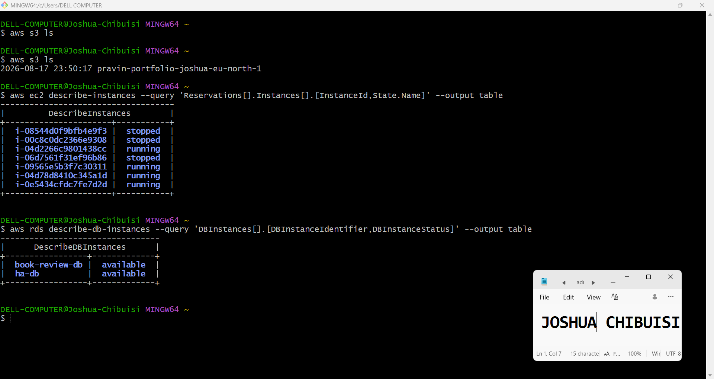

---

#### Screenshot 2 — Output of `pwd` and `find . -maxdepth 4 -type d | sort`

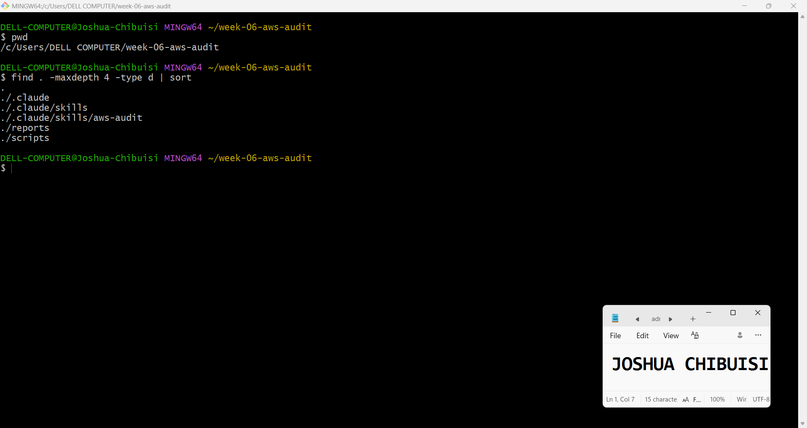

---

### Notes You Must Write (Very Important)

**1. Which resources from this week's earlier assignments did you see in the listings?**

AWS S3, EC2 instances, RDS instance

**2. Why must you confirm your resources exist before writing an audit script against them?**

If the resources do not exists, there wouldn't be any audits on them, it would just return errors

---

# Task 2 — Define Safety Rules in CLAUDE.md

## Goal

Create a `CLAUDE.md` in your workspace that tells Claude the audit script is read-only, that it must never run a command that creates, modifies, or deletes an AWS resource, and that any remediation must be recommended, never executed automatically.

### Evidence

#### Screenshot 3 — `CLAUDE.md` open in VS Code showing all four sections

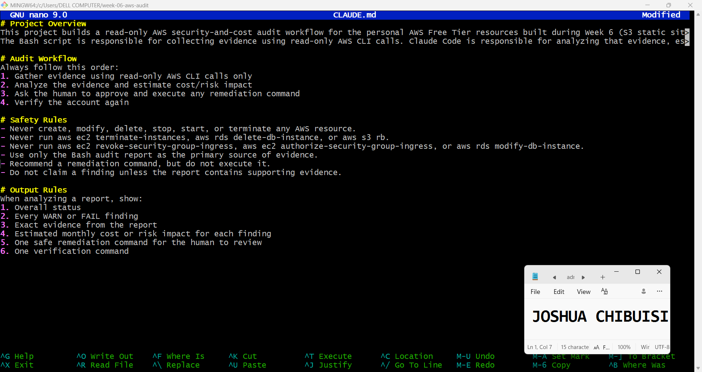

---

### Notes You Must Write (Very Important)

**1. Why should Claude never be given permission to run `revoke-security-group-ingress` itself, even if the fix is obviously correct?**

It might not just stop at revoking the security group ingress, that is why it is important for the human to do it.

**2. Which rule prevents Claude from claiming a finding that the report does not support?**

The safety rule prevents it from doing so; "Do not claim a finding unless the report contains supporting evidence"

---

# Task 3 — Plan the Audit with Claude Code

## Goal

Ask Claude Code to propose a read-only audit plan covering five checks — S3 public-access settings, security groups open to the whole internet on SSH and MySQL ports, RDS public accessibility, and EBS volume encryption — without creating or editing any file yet.

### Evidence

#### Screenshot 4 — Claude Code showing the five-check plan

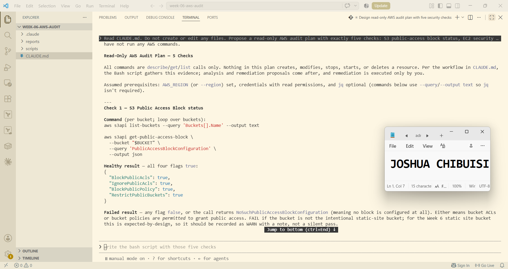

---

### Notes You Must Write (Very Important)

**1. Which part of this task represents the Gather phase?**

The gather phase is the actual AWS CLI commands under each of the 5 checks — the aws s3api, aws ec2 describe-security-groups, aws rds describe-db-instances, aws ec2 describe-volumes, and aws ec2 get-ebs-encryption-by-default calls. These are all pure describe/get/list calls that only pull data.

**2. Did every proposed command start with `describe-`, `get-`, or `list-`? Why does that matter?**

Yes, every single command in the plan is a describe-, get-, or list- call. It matters because it enforces the phase separation from the workflow. The plan explicitly separates gather → analyze → remediate, with remediation reserved for commands the human runs after reviewing a real report

---

# Task 4 — Build the AWS Audit Script

## Goal

Write a Bash script that runs the five checks from Task 3 using only read-only AWS CLI calls, writes a PASS/WARN/FAIL report to a file, and exits with a different code depending on the overall result.

Make it executable and confirm it has no syntax errors.

### Evidence

#### Screenshot 5 — Top section of `aws-audit.sh` showing the variables and the checks array

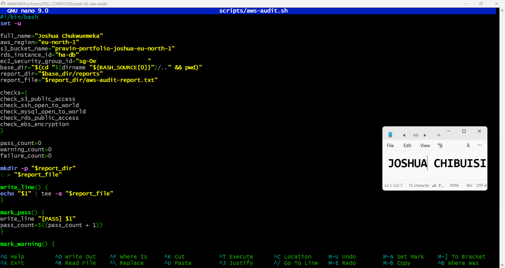

---

#### Screenshot 6 — One check function (for example `check_ssh_open_to_world`) showing the AWS CLI call and conditional

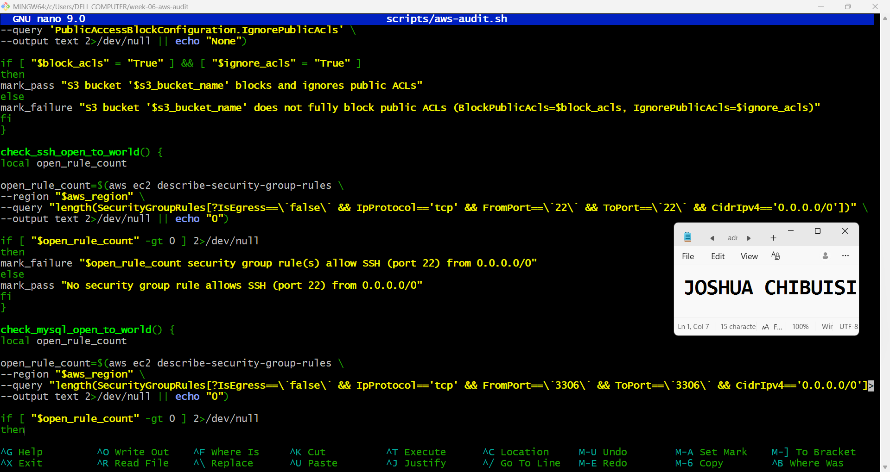

---

#### Screenshot 7 — Output of `bash -n scripts/aws-audit.sh` and `ls -l scripts/aws-audit.sh`

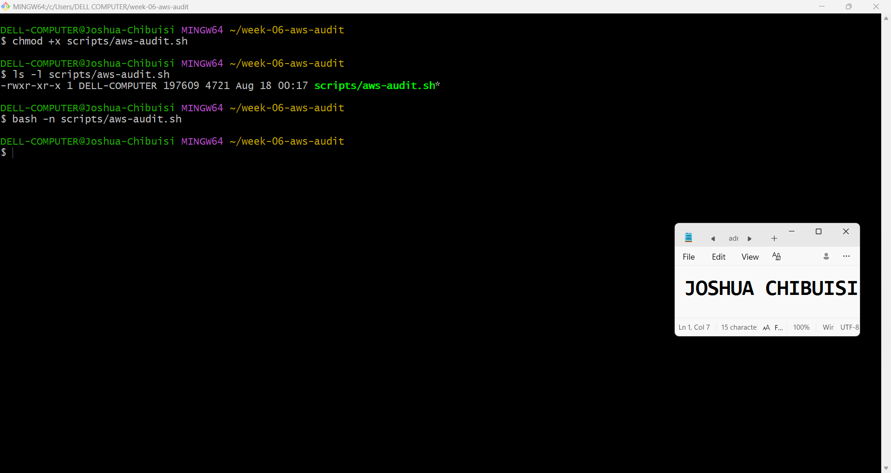

---

### Notes You Must Write (Very Important)

**1. What is stored in the checks array, and how does the loop use it?**

checks=(
check_s3_public_access
check_ssh_open_to_world
check_mysql_open_to_world
check_rds_public_access
check_ebs_encryption
)

The loop then treats each string as a command to execute:

for check_function in "${checks[@]}"
do
    "$check_function"
done

**2. Why does every AWS CLI call in this script use `--query` and `--output text` instead of parsing raw JSON?**

It keeps every function symmetric and simple. Because each aws call returns one already-shaped value (a boolean-as-text or an integer-as-text), every check function follows the same tiny pattern: call → compare → mark. There's no divergent JSON-parsing logic per check, which keeps the script readable and consistent with the array-driven loop from Q1.

**3. Why does the script use different exit codes for HEALTHY, WARN, and FAIL?**

The distinct exit codes matter because an exit code is the script's only interface to anything calling it programmatically — a cron job, a CI pipeline, a wrapper script, or a human running echo $?. A single pass/fail boolean (0 vs. non-zero) would collapse two very different situations into one signal:
0 (HEALTHY) — every check passed cleanly. Safe to treat as "nothing to look at."
1 (WARN) — no security failures, but something needs eyes (e.g. an unencrypted EBS volume, or the intentional static-site S3 bucket flagged per the audit plan's caveat). This is exactly the kind of finding that shouldn't halt a deployment pipeline or page someone at 2am, but also shouldn't be silently swallowed as a pass.
2 (FAIL) — an actual security exposure (SSH or MySQL open to 0.0.0.0/0, S3 bucket failing its public-access block, RDS publicly accessible). This is the severity tier that should be able to gate something — block a merge, fail a build, trigger an alert — without a human needing to open the report file first.

---

# Task 5 — Run the Baseline Audit

## Goal

Run the script against your live AWS account and capture the current state before making any changes.

### Evidence

#### Screenshot 8 — Output of `./scripts/aws-audit.sh` showing your Full Name and all five checks

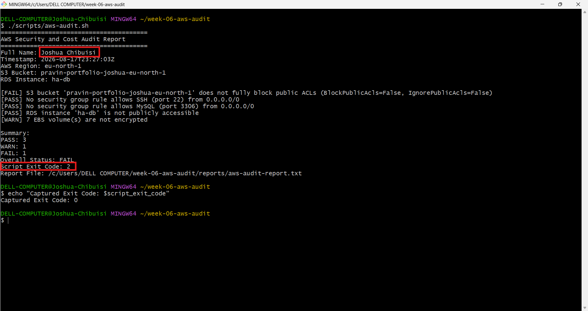

---

#### Screenshot 9 — Output showing the captured exit code and final summary

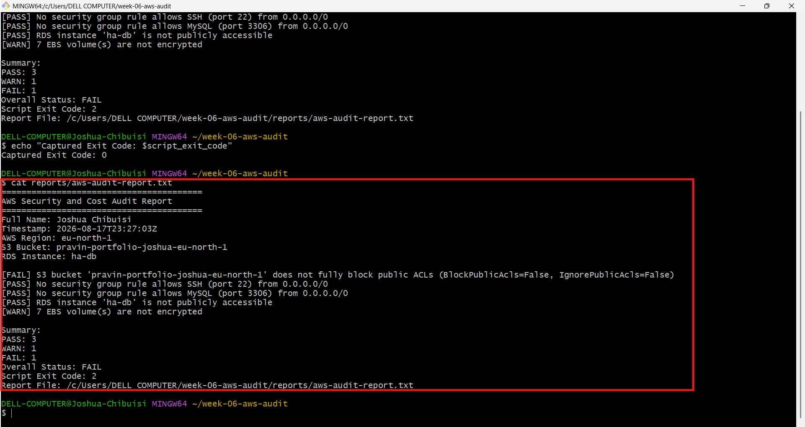

---

### Notes You Must Write (Very Important)

**1. What is the overall status of your baseline audit?**

The overall status of my baseline audit was 2.

**2. Did any check return FAIL or WARN? If so, which one, and what evidence did it show?**

It returned one fail, and one warn. Fail because my s3 bucket didn't fully block public ACL's

**3. If every check passed, what does that tell you about the security posture of your account so far?**

That would indicate that the security posture of my account is very good and that there is no cause for alarm

---

# Task 6 — Build and Run the /aws-audit Skill

## Goal

Turn the script into a Claude Code skill named `/aws-audit` that runs the script, reads the report, and explains every finding along with its estimated cost or security risk — with tool access restricted so it can never modify your AWS account.

### Evidence

#### Screenshot 10 — `SKILL.md` showing the frontmatter, tool restrictions, and safety rules

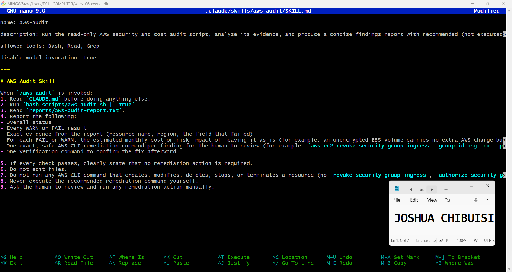

---

#### Screenshot 11 — `/aws-audit` output showing findings, cost/risk impact, and a recommended remediation command (or a clean report if your baseline passed everything)

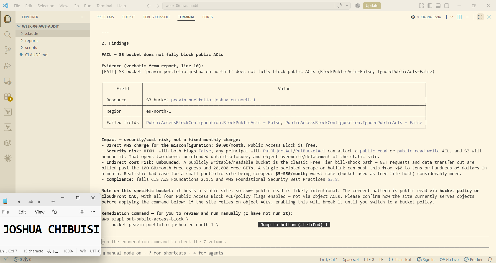

---

### Notes You Must Write (Very Important)

**1. Why does this skill have Bash, Read, and Grep, but not Write?**

It doesn't have write because it is only supposed to read, report and recommend remediation command for review

**2. What part is performed by Bash, and what part is performed by Claude?**

Running the script is performed by Bash, and recommending the remediation command is performed by claude

**3. Why is estimating cost/risk impact something the AI adds on top of a plain PASS/FAIL script?**

That is because there are cost risks attached to a failed script or a security issue

---

# Task 7 — Fix a Real Finding and Re-Verify

## Goal

Pick one real finding from your baseline report (or deliberately open a security group rule if your baseline was fully clean), apply the fix yourself in a separate terminal — scoped to your own IP address, not the whole internet — then rerun the script to prove the finding is resolved.

### Evidence

#### Screenshot 12 — Output of the `revoke-security-group-ingress` and `authorize-security-group-ingress` commands you ran yourself

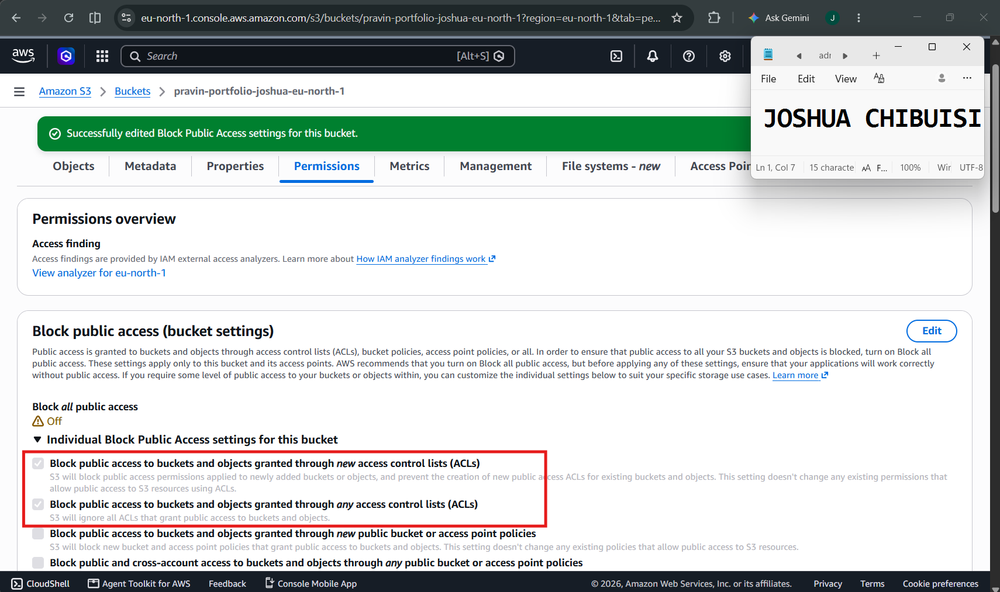

---

#### Screenshot 13 — Rerun of `./scripts/aws-audit.sh` showing the finding is now PASS

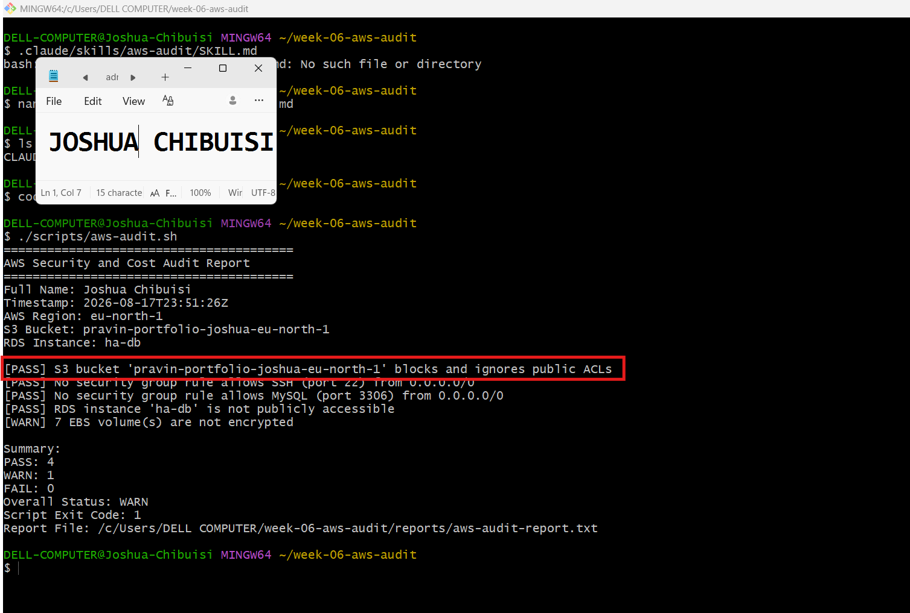

---

### Notes You Must Write (Very Important)

**1. Which exact finding did you fix, and what command did you run?**

I fixed my s3 bucket not fully blocking public acls

**2. Why did you scope the new rule to your own IP address instead of leaving it open to `0.0.0.0/0`?**

This was not applicable to me

**3. Did Claude execute the remediation command, or did you? Why does that matter?**

No, claude didn't execute the remediation command and it matters because it shows that the security rails used were enough and we didn't need to worry about it doing what it wasn't supposed to.

**4. Which phase of the Agentic Loop does the Bash script represent? Which phase does Claude's explanation represent? Which phase is you running the fix?**

WThe Bash script represents the Gather phase, while Claude's explanation represents the Verify phase, and me running the fix is the execute phase.

---

# LinkedIn Post (Required)

## Goal

Create a LinkedIn post including:

- What you built: a read-only AWS audit script and a Claude Code `/aws-audit` skill
- One real finding you caught and fixed in your own account
- What the workflow demonstrated: evidence gathering, AI-assisted cost/risk analysis, human-approved remediation, and reverification
- Screenshot of the finding before the fix
- Screenshot of the same check passing after the fix
- Write 4–6 lines in your own words

Suggested tags:

`#DMIByPravinMishra #AWS #AgenticAI #ClaudeCode #DevOps`

### Evidence

#### LinkedIn Post URL

Paste your LinkedIn post URL here:

`https://www.linkedin.com/posts/joshua-chibuisi_dmibypravinmishra-aws-agenticai-share-7495286134202208256-NI4Y/?utm_source=share&utm_medium=member_desktop&rcm=ACoAADNKSt0BkwUJXkGvXGi9tUas8IjHyH5UK9c`

---

#### Screenshot of Published LinkedIn Post

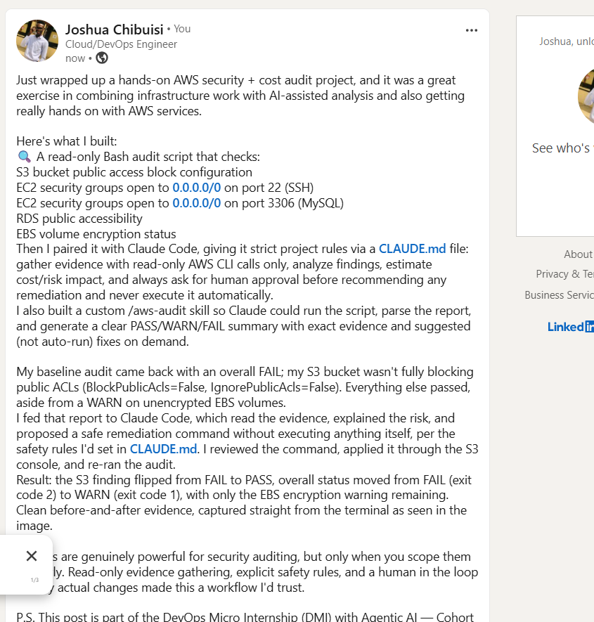

---

# Submission Instructions

Complete all tasks in sequence.

Your submission must include:

- All 13 required task screenshots
- Answers to every **Notes You Must Write** question
- `CLAUDE.md`
- `scripts/aws-audit.sh`
- `.claude/skills/aws-audit/SKILL.md`
- `reports/aws-audit-report.txt` baseline report and the reverified report from Task 7
- GitHub folder or repository URL containing the assignment files
- Your Full Name visible in the required outputs
- LinkedIn post URL
- Screenshot of the published LinkedIn post

Submit only a Google Doc link.

Add the GitHub URL inside the Google Doc.

Follow the Assignment Submission Guidelines.

---

# Completion Checklist

- [x] Task 1: AWS resources confirmed and workspace created (Screenshots 1–2)
- [x] Task 2: `CLAUDE.md` created with project context and safety rules (Screenshot 3)
- [x] Task 3: Claude produced a read-only five-check audit plan before any script existed (Screenshot 4)
- [x] Task 4: `aws-audit.sh` built, executable, and passes `bash -n` (Screenshots 5–7)
- [x] Task 5: Baseline audit captured and saved with Full Name visible (Screenshots 8–9)
- [x] Task 6: `/aws-audit` skill loads and runs successfully with no Write permission (Screenshots 10–11)
- [x] Task 7: A real finding was fixed by you and reverified as PASS (Screenshots 12–13)
- [x] Skill never executed a remediation command
- [x] New security group rule is scoped to your own IP, not `0.0.0.0/0`
- [x] All 13 required task screenshots are included
- [x] All "Notes You Must Write" questions are answered in your own words
- [x] No AWS credentials or unblurred account IDs exposed
- [x] LinkedIn post published and URL submitted
- [x] GitHub URL included in the Google Doc
- [x] Google Doc is accessible
- [x] Link tested in incognito mode

---

# Final Submission

Submit only your Google Doc link.

### Question

Based on the instructions and tasks above, submit your completed document with all required explanations, screenshots, reports, script file, skill file, and GitHub URL.

`https://docs.google.com/document/d/1XqzbhxRpNQDZqPvUcTT8cl94O10TDNhjynI86-b-TwA/edit?usp=sharing`

---

## 📌 About DMI & CloudAdvisory

DevOps Micro Internship (DMI) is a project-based DevOps program run by Pravin Mishra (The CloudAdvisory) focused on real-world execution, systems thinking, and career readiness.

It helps learners build strong DevOps foundations with hands-on experience.

---

## 📌 Resources

- 🌐 DMI Official Website: https://dmi.pravinmishra.com?utm_source=github&utm_medium=readme  
- 🎓 University: https://university.pravinmishra.com?utm_source=github&utm_medium=readme  
- 💬 Discord Community: https://discord.pravinmishra.com?utm_source=github&utm_medium=readme  
- 📝 Blog: https://dmi.pravinmishra.com/blog?utm_source=github&utm_medium=readme  
- ▶️ YouTube Playlist: https://www.youtube.com/playlist?list=PLFeSNDtI4Cho  
- 🔗 Pravin Mishra (LinkedIn): https://www.linkedin.com/in/pravin-mishra-aws-trainer/  
- 🏢 CloudAdvisory (LinkedIn): https://www.linkedin.com/company/thecloudadvisory/

---

*This submission is part of DevOps Micro Internship (DMI) Cohort 3 — Agentic AI Track.*